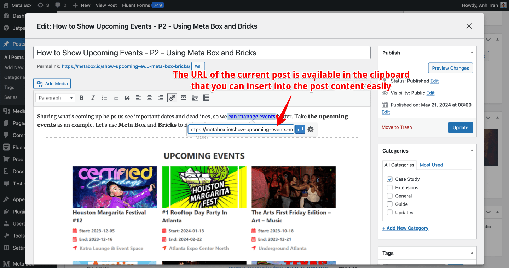

Besides the [report for links of a specific post](/slim-seo-link-manager/post-links/), the plugin also **suggests related posts for you to build links with**. The plugin also allows you to connect different WordPress sites and suggest links between them. This feature is very useful to **build internal links** as well as **build backlinks** for your websites.

To get link suggestions *when editing a post*, click the **Link Suggestions** tab in the **Link Manager** meta box, below the post content:

The plugin has 2 modes for link suggestions:

- **Automatic**: automatically suggests other posts to link to **based on the keywords in the post content**. The plugin will find all posts that have the keywords in the post content and show them to you so you can link to them.
- **Manual**: allows you to search for posts by keywords to link to. The plugin shows **most used words from the post content** that you can search faster by clicking on them.

Slim SEO Link Manager also allows you to find posts that in the same category or tag with the current post by enabling the **Same taxonomies** switch. In this case, you will get only related posts in the same category/tag.

For each found post, the plugin will **suggest the sentence that has the related content to the post, where you should put the link**. To save you time, a **Copy link** button is also available for you to copy the post URL.

With this feature, you can **find related posts and link to them quickly**. When you add a link to another post, the link will be updated in the reports immediately (see the **Link reports** section above). It's a great way to build internal links and improve your website SEO!

## How do link suggestions work?

To get related posts, the plugin will break the content of current post into sentences. For each sentence, it will find posts that **their title has common words with the sentence**.

If the duplication rate of the words is above 30%, then the plugin will suggest the post for you to link to from that sentence. Otherwise, the post will be ignore.

This way, the plugin ensures suggested posts are quite related to sentences and you can pick them to build links.

## Create links from old posts to new posts

By default, Slim SEO Link Manager allows you to build links from the current post to exsiting posts. This way, the existing posts will have more internal links and will become stronger in term of SEO.

However, you can do backward with the plugin, e.g. **build links from existing posts to the current post**. So the new post will immediately have internal links and thus, will be indexed and ranked faster.

To do that, from the list of related (suggested) posts, click the edit icon to edit that post:

A popup will appear. In the popup, you'll see the familiar edit screen of the selected old post, where you can edit its content and insert links. To make it more convenient, the plugin **automatically copies the URL of the current post to the clipboard**, so you can easily paste into the old post's content easily and fast.

## Link to your external sites

If you have multiple external sites and you want the plugin suggest links from them, you can do that with Slim SEO Link Manager!

The plugin allows you to connect multiple sites together in a network, and suggest related or relevant links from all sites in the network when you edit a post.

For more details, please see [interlinking external sites](/slim-seo-link-manager/interlinking-external-sites/).