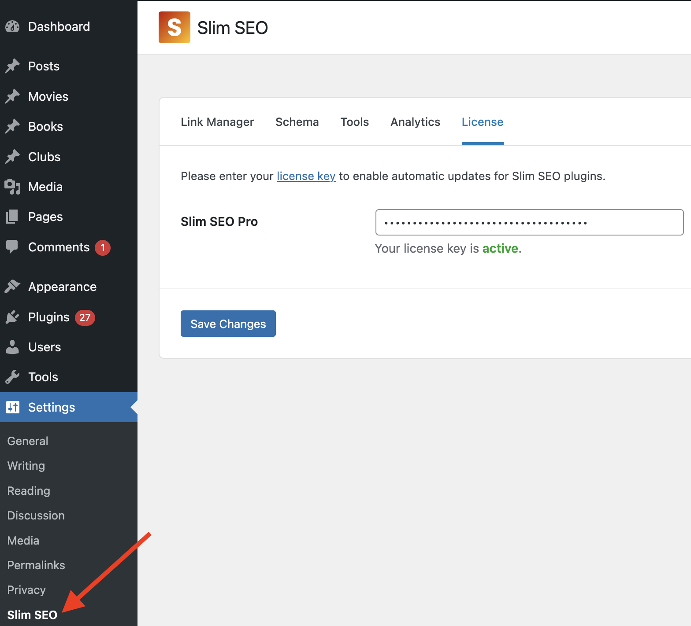

Slim SEO Pro is a WordPress plugin. Installing it is similar to installing any other WordPress plugin:

- Go to [My Account](https://wpslimseo.com/my-account/) page and download the plugin's `.zip` file.
- In your WordPress dashboard, go to **Plugins > Add New** and click the **Upload Plugin** button.
- Select the downloaded `.zip` file to upload and click the **Install Now** button.
- Activate the plugin.

:::

After installing, go to **Settings > Slim SEO** to access the plugin's settings page.

Now you need to [add license key](/slim-seo-pro/license/) to use the plugin.
