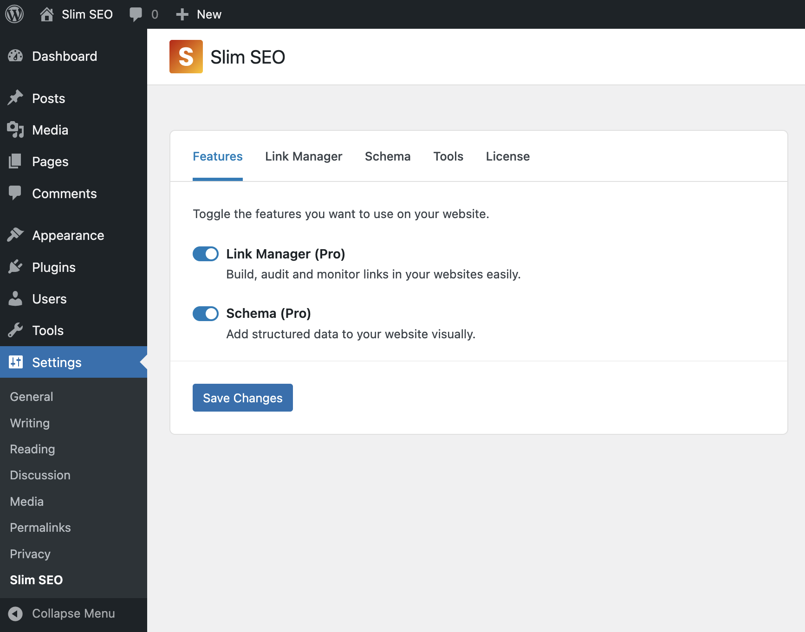
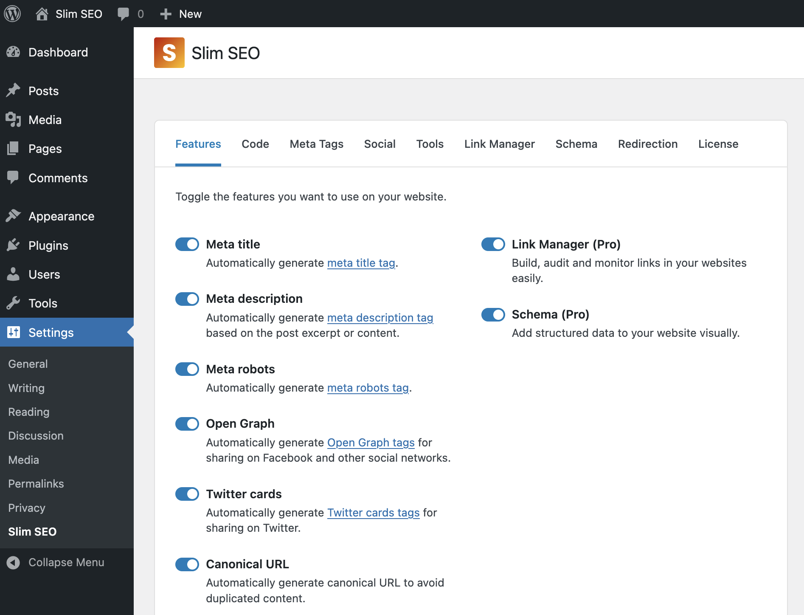

Slim SEO Pro is a WordPress plugin. Installing it is similar to installing any other WordPress plugin:

- Go to [My Account](https://wpslimseo.com/my-account/) page and download the plugin's `.zip` file.
- In your WordPress dashboard, go to **Plugins > Add New** and click the **Upload Plugin** button.
- Select the downloaded `.zip` file to upload and click the **Install Now** button.
- Activate the plugin.

## Slim SEO Free vs Slim SEO Pro

Let's clear up a common question: **Slim SEO Pro is not an upgrade of Slim SEO Free.** They are two separate plugins, each with its own set of features.

Here's how it works:

- **Slim SEO Free** focuses on core SEO essentials - meta tags, sitemaps, Open Graph, schema markup, and more. It's a complete SEO plugin on its own.
- **Slim SEO Pro** focuses on advanced features - link manager, custom schemas, writing assistant, entities, Search Console integration, and more. It's also a complete plugin on its own.

Some features exist only in Free. Some exist only in Pro. A few overlap. For example, both Free and Pro can output schema markup, but Pro lets you create custom schemas that Free doesn't.

Think of them as two separate tools that each do different jobs. You can choose to install just one, or both if you want the full set of features.

### Should you install Slim SEO Free alongside Pro?

Slim SEO Pro works perfectly fine on its own - it **doesn't require** Slim SEO Free to run. You can use just Pro and get everything it offers.

However, if you want the features that only Slim SEO Free provides (like automatic meta tags, sitemaps, Open Graph, and more), then you should **install and activate Slim SEO Free alongside Pro**. Both plugins work well together and complement each other.

To install Slim SEO Free:

- Go to your *WordPress Dashboard > Plugins > Add New*
- Search for "**Slim SEO**"
- Click **Install** then **Activate**

When both plugins are active, they share the same menu item under **Settings > Slim SEO**, with Free's settings and Pro's settings combined into one page.

:::info

Slim SEO Pro also works with any SEO plugin such as Yoast SEO, RankMath, SEO Framework, and SEOPress, ...

:::

After installing, go to **Settings > Slim SEO** to access the plugin's settings page.

If you have Slim SEO Free activated, then you'll find Slim SEO Pro under the same menu, but there are more tabs for more features from Slim SEO Free:

Now you need to [add license key](/slim-seo-pro/license/) to use the plugin.
