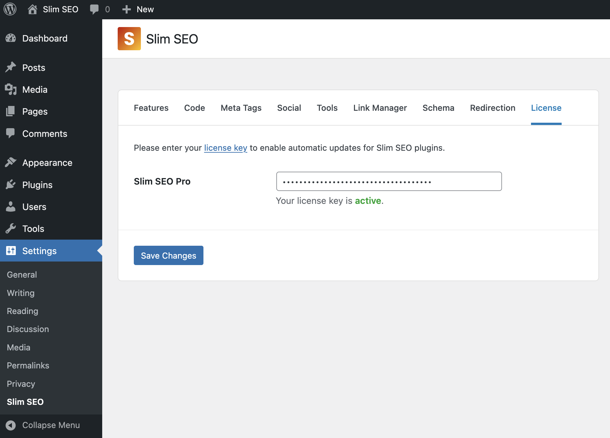

## Adding a license key

Before using Slim SEO Pro, you need to add your license key. Go to **Settings > Slim SEO** and click the **License** tab, then enter the license key in the input box:



Then click **Save Changes** to validate the license key. If your license key is valid and your license is active, you can start using the pro features like [schema](/slim-seo-pro/schema/adding-schemas/) or [link manager](/slim-seo-pro/link-manager/scanning-links/). Otherwise, you'll see a notification in the admin area to update the license key.

## FAQs

### What happens if my license expires?

- You won't receive any updates or bug fixes from us.
- You can't access to our support.
- All premium features will be disabled, including:
  - You won't be able to add or edit schemas in the admin.
  - The existing schemas that you already setup for your site won't be outputted in the front end.
  - You won't be able to see any reports for links and search performance in the admin or when editting a post.
  - You won't be able to get suggestions to improve writing or build links.

### Can I define the license key in `wp-config.php`?

Yes, you can. Please define your license key as follows:

```php
define( 'SLIM_SEO_PRO_KEY', 'your license key here' );
```

In this case, the plugin won't save the license key in the database and hide it from all eyes.
