## Analytics

Before using Analytics in Slim SEO Pro, you need to get Google Client ID and Client Secret. Follow these steps:

1. Go to [Google Cloud](https://console.cloud.google.com/) page.
2. Search `Google Search Console API`

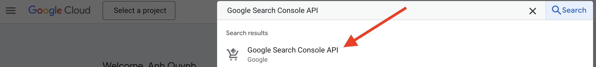

3. Enable Google Search Console API

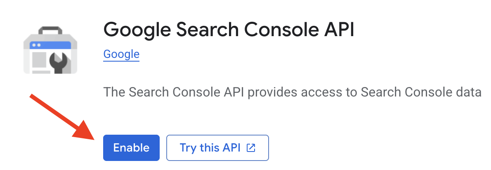

4. Create Branding (If you already do it, please ignore this step and go straight to step 5)

- Sidebar Menu > select Oauth Consent Screen
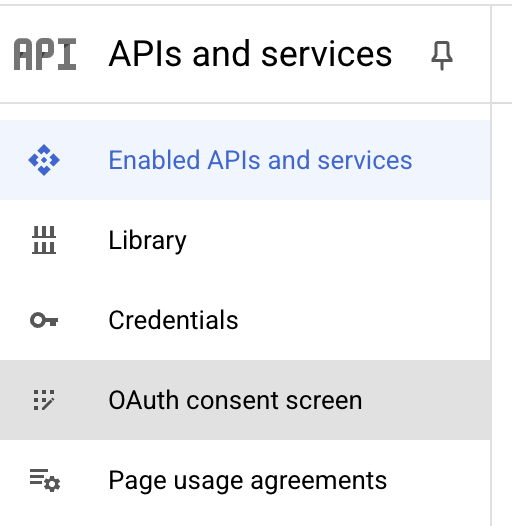

- Then select Branding on the menu
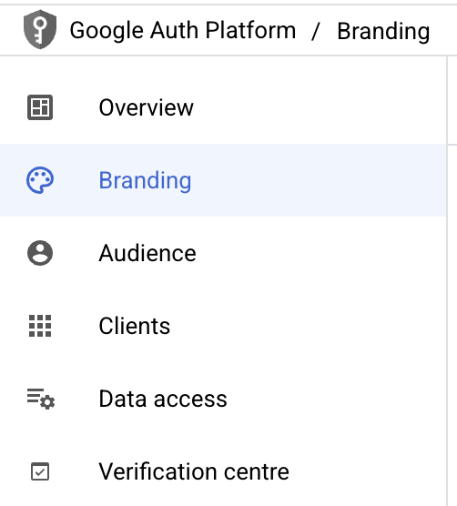

- Enter your information by following their instruction:

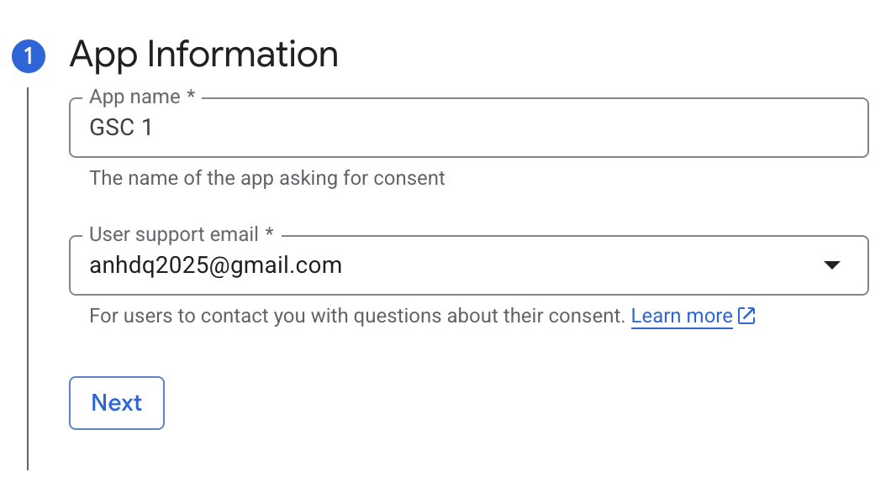

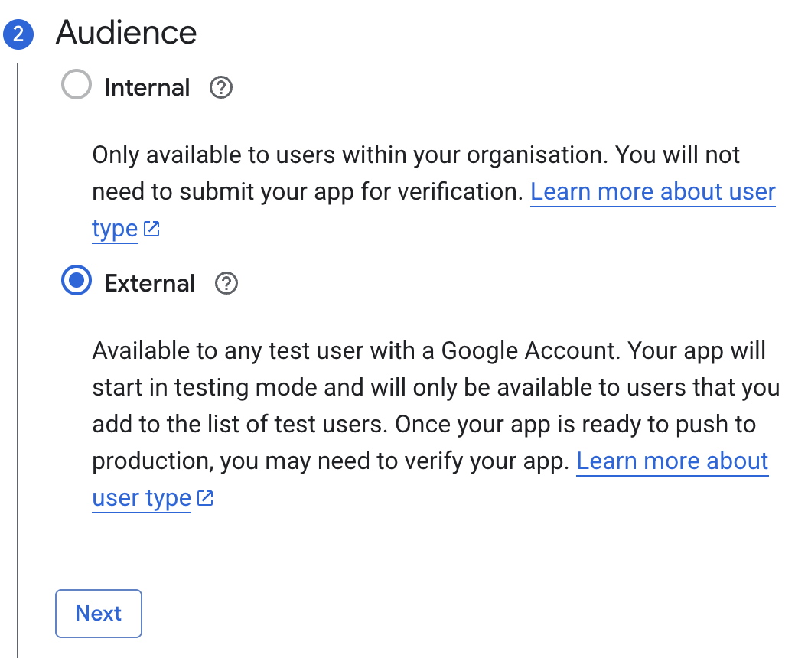

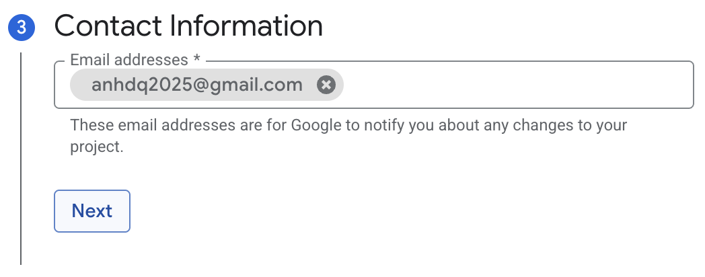

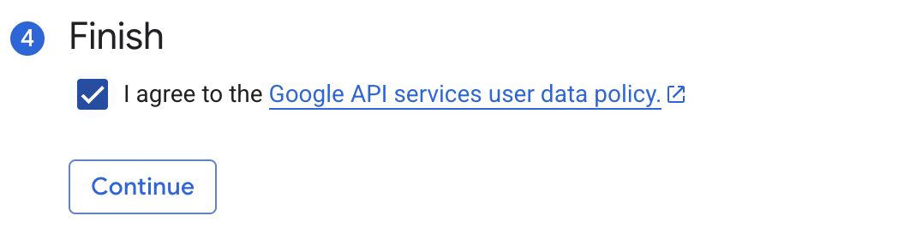

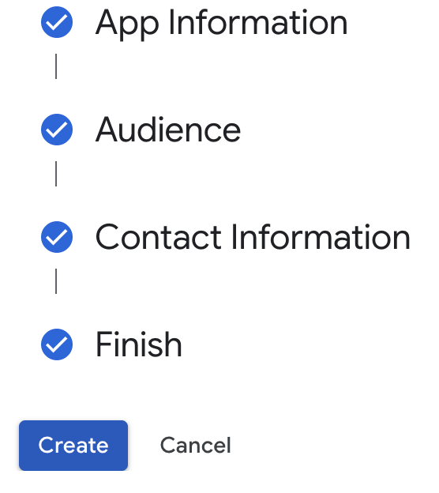

5. Add Authorised domain

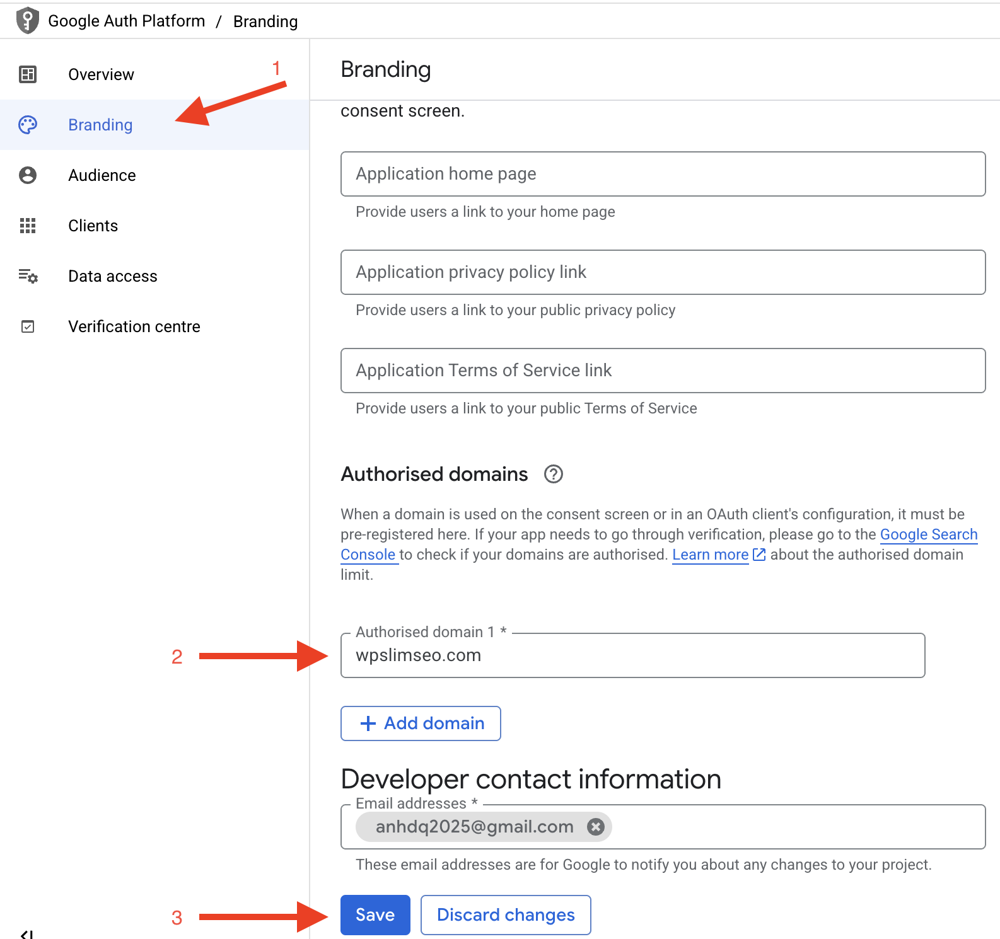

6. Setup Audience

Select `Audience` on the menu, you have 2 options:

- Testing (default), this is our recommend to use, you will have to add Test users if you select this one.
- Publish app.

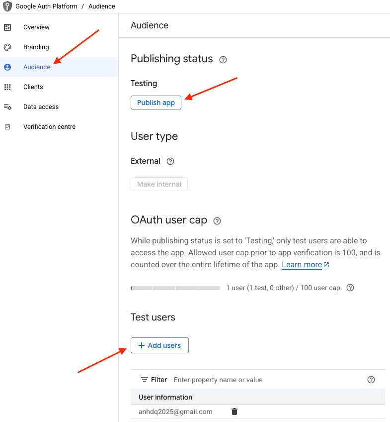

7. Create OAuth in Credentials tab 

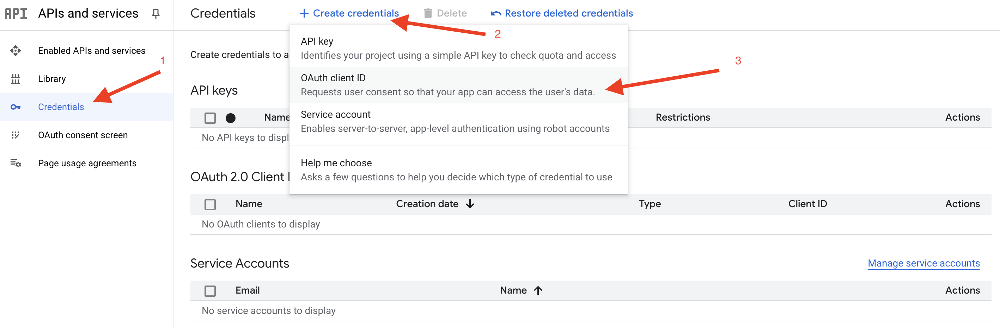

Select `Web application` in `Application type` dropdown and enter `yourdomain/?ssp_gsc_callback=1` in `Authorised redirect URIs`

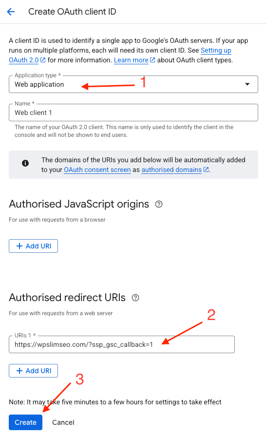

After create OAuth client ID, you will have `Client ID` and `Client Secret`

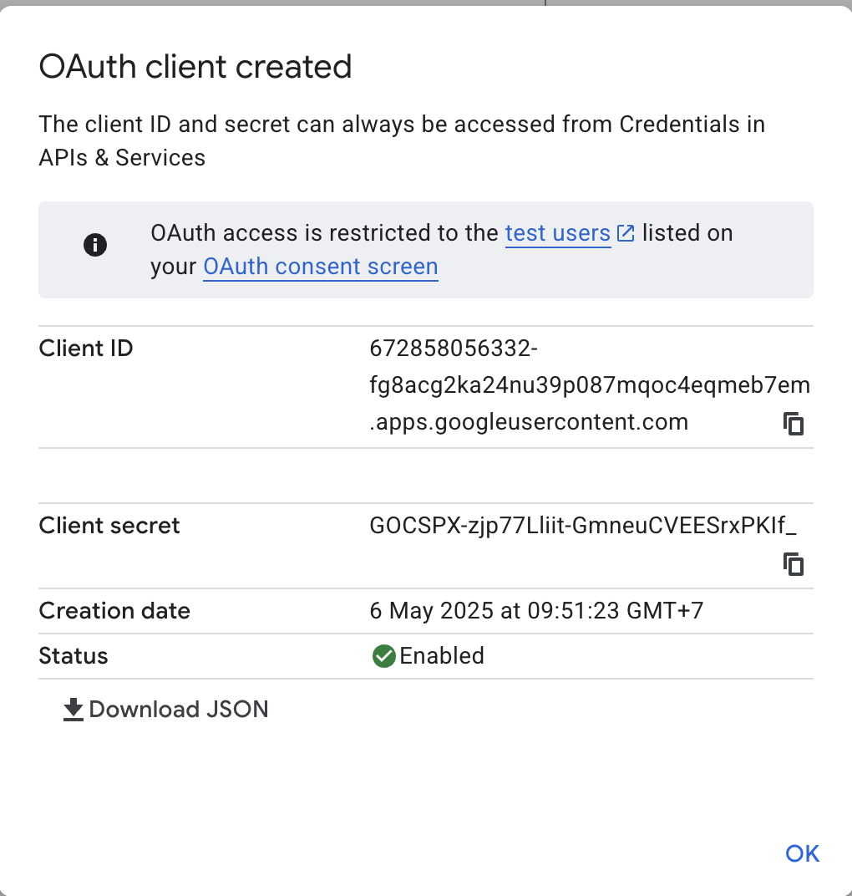

8. Enter `Client ID` and `Client Secret` you have in step 6 and click `Save Changes`

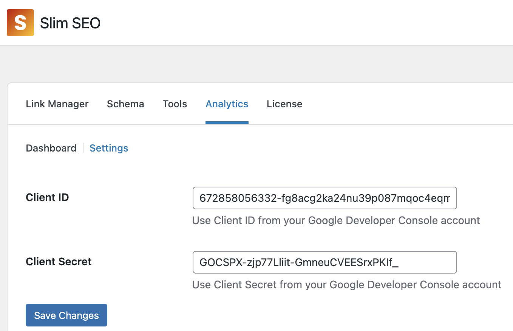

9. For the first time using Analytics, after step 7 you will have to get Google authentication token by click the link

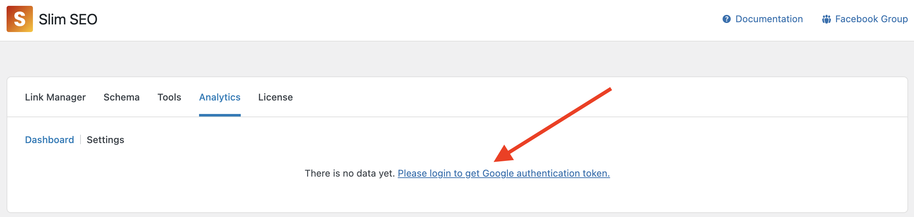

follow their instruction:

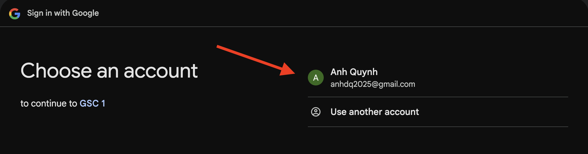

Notice: use the same email you entered on step 6 if you are using Testing mode.

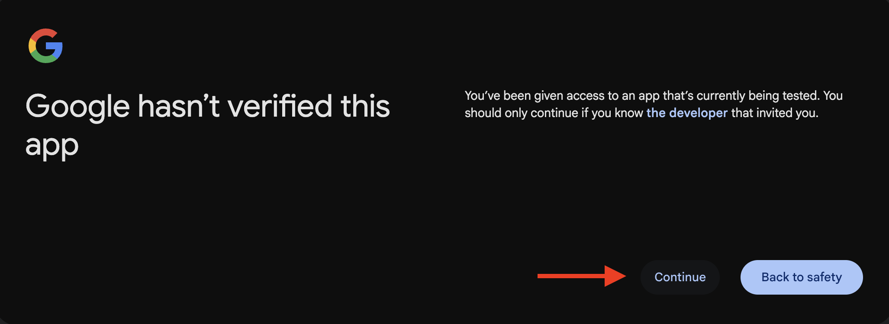

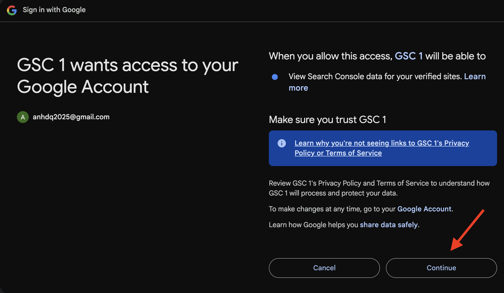

After all these steps, it will redirect you back to Analytics and ready for you to use:

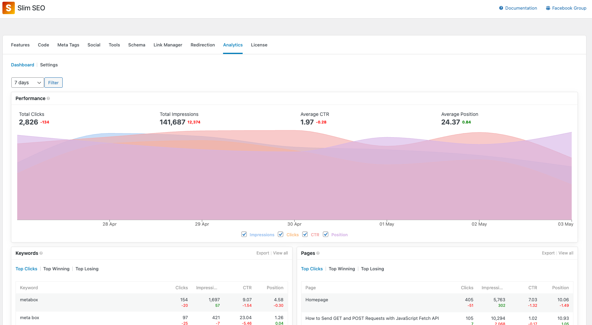