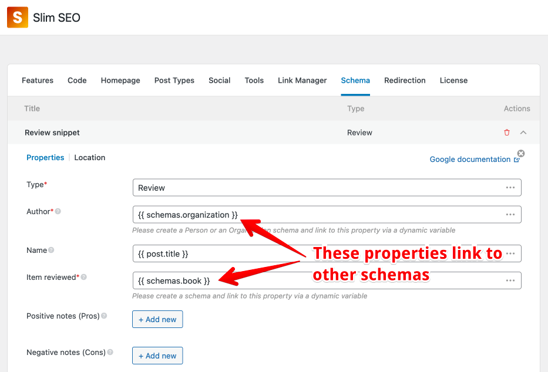
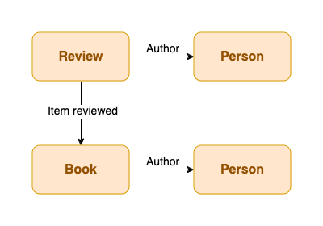
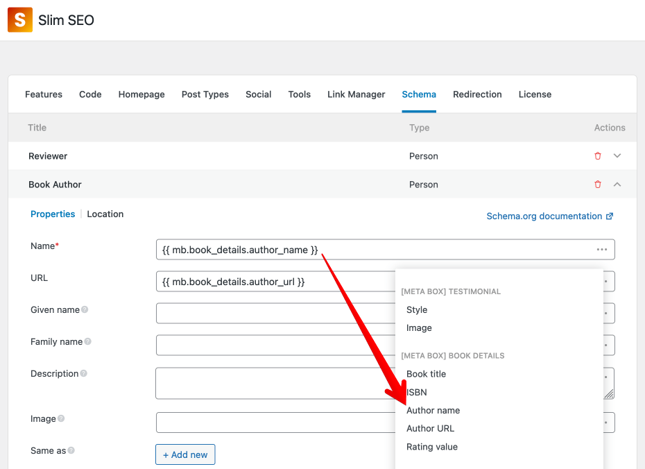
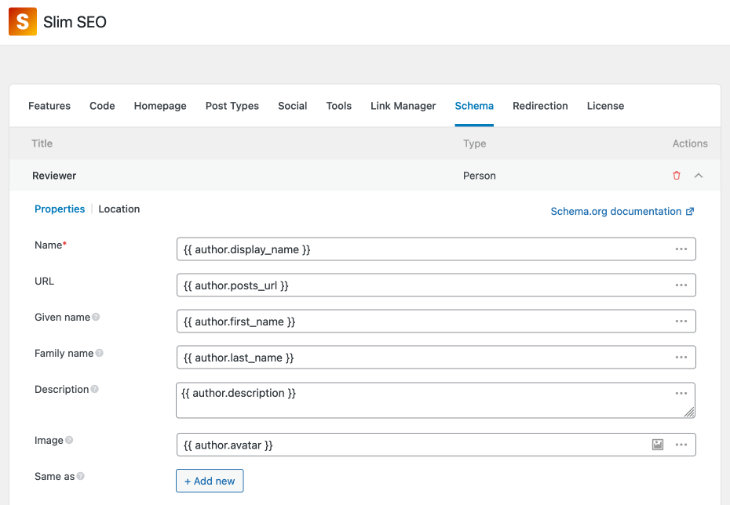
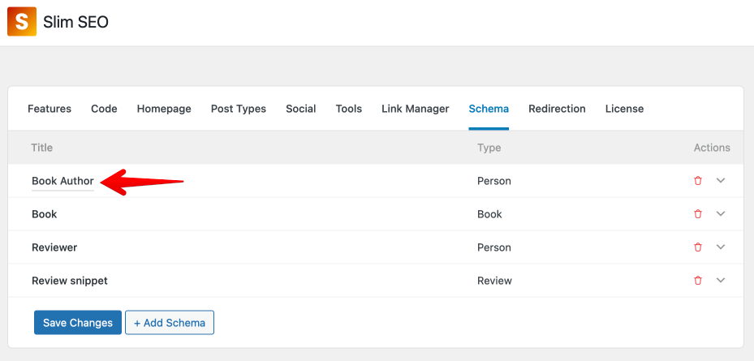

import LiteYouTubeEmbed from 'react-lite-youtube-embed';
import 'react-lite-youtube-embed/dist/LiteYouTubeEmbed.css';

Connecting schemas together via properties is a powerful feature of Slim SEO Link Manager. With this feature, you can build individual schemas, and then **link from one schema to another one via a property** (with the help of [dynamic variables](/slim-seo-pro/schema/dynamic-variables/)).

For example, if you want to add a schema for a review of a book, then you can build two separate schemas: Review and Book. Inside the Review schema, you can set its property "item reviewed" that links to the Book schema. This way, you connect the Book schema to the Review schema as a property.

## Why multiple schemas?

Using individual schemas gives you **more options to enter a lot of properties for each schema**, which is quite hard to do if implementing them as nested schemas (that you probably see in another schema plugin for WordPress).

Another benefit of this method is that you can **reuse schemas**. For example, you can build an Organization schema that can be the author of the review for a Book schema, and also be the organization of the current WebSite.

## How to link schemas?

Let's create a review (Review schema) for a book, which has the following details:

- The review has an author property, which is a Person schema (the current user)
- The review has an "item reviewed" property, which links to the Book schema
- The Book schema has an author property which is another Person schema (which gets data from custom fields from the "book" post type)

This is the diagram of how these schemas connect to each other:

Now let's create these schemas:

First, we'll create a Person schema for the book author. Simply add a Person schema to the list. Note that you have to use [dynamic variables](/slim-seo-pro/schema/dynamic-variables/) to add values from custom fields to the properties:

:::info

I'm using [Meta Box](https://metabox.io) to create the custom post type and custom fields for books. Slim SEO Pro has a [deep integration with Meta Box](/slim-seo-pro/schema/integrations/meta-box/). You can also use ACF which is [also supported](/slim-seo-pro/schema/integrations/acf/).

:::

Then we'll create a Book schema. When adding a Book schema, you should fill the properties with values from custom fields (via dynamic variables). For the **Author** property, make sure you select the Person schema that you created in the step above:

The next step is creating a Person schema for the reviewer. Simply add a Person schema to the list and it will automatically fill with the current user data, which is good:

:::info Changing schema title

When building multiple schemas, you might have the same schema types. To differentiate them, you can change their title. To change the title, click the schema title in the title bar and enter a new title:

:::

Finally, create a Review schema. Now, as you already have Book and Person (reviewer) schemas, you can connect them in the Review schema:

That's all! All schemas are connected. You can add as many properties for each of them as you want. This way, each schema can provide search engines a lot of details.

## Video tutorial

**David McCan** from WebTNG created a very detailed tutorial on how to build schemas and connect them together for a real-life case that you can see below:

<LiteYouTubeEmbed id='M8T7ughyZwk' />

## Notes

In the example above or in the video tutorial, you can notice that **schemas can be inserted almost everywhere, just like dynamic variables**.

To make it easy for you to compose your schemas, we also add **basic schemas such as Thing, Image, Person, and Organization** for you to build small pieces of data and insert them into other schemas as properties:

