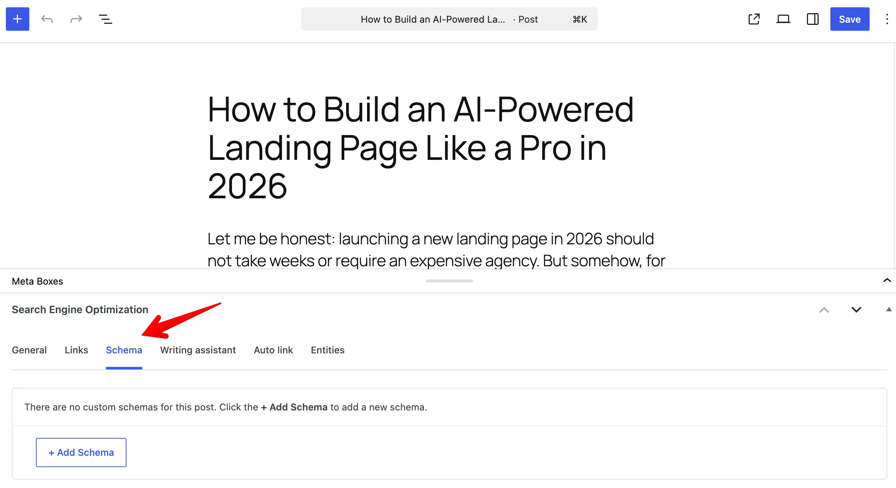
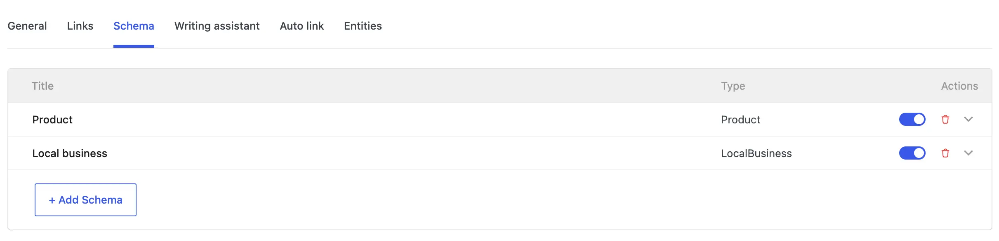

In addition to global schemas set in the settings page, you can also create custom schemas for individual posts and pages.

## Adding a schema to a post or page

To add a schema, open the post or page editor and look for the **Schema** tab inside the **Search Engine Optimization** meta box below the editor.



Click **+ Add schema**, then choose a schema type from the list. After that, fill in the required properties - just like when creating a global schema.



All available properties are the same as in the [global schema settings](/slim-seo-pro/schema/adding-schemas/#properties), including support for [dynamic variables](/slim-seo-pro/schema/dynamic-variables/).

When you're done, click **Save** or **Update** to apply the changes.

## How post schemas work

Schemas added directly to a post or page take priority over global schemas. If a post has its own schema, global schemas will not be applied.

:::warning

Schemas set at the post level always override global schemas.

:::

## Restrict schema settings to admins only

If you want only administrators to manage schema settings, you can hide the meta box for other user roles using this snippet:

```php
// Hide SEO settings meta box for posts.
add_filter( 'slim_seo_meta_box_post_types', function ( $post_types ) {
	return current_user_can( 'manage_options' ) ? $post_types : [];
} );

// Hide SEO settings meta box for terms.
add_filter( 'slim_seo_meta_box_taxonomies', function ( $taxonomies ) {
	return current_user_can( 'manage_options' ) ? $taxonomies : [];
} );
```

:::warning

Slim SEO Pro uses the [same filters](/slim-seo/meta-title-tag/) as Slim SEO to control the visibility of the meta box. This means the snippet above will hide both schema settings and SEO settings.

:::