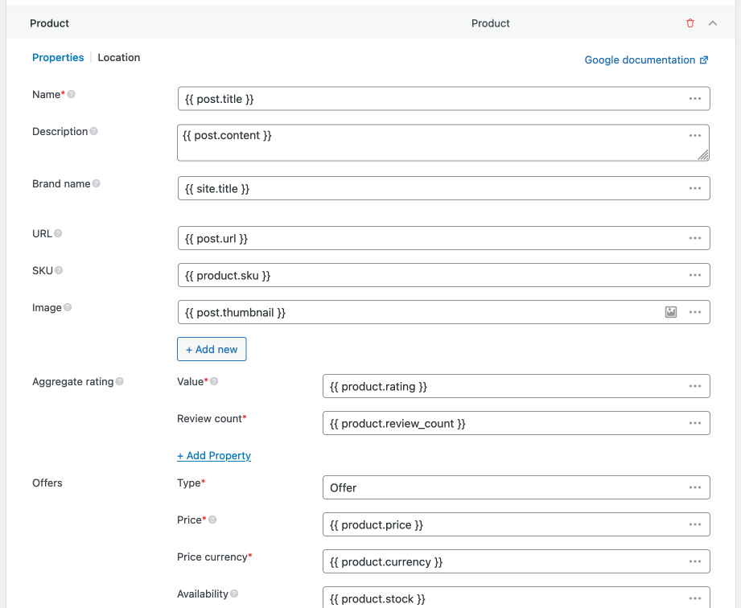
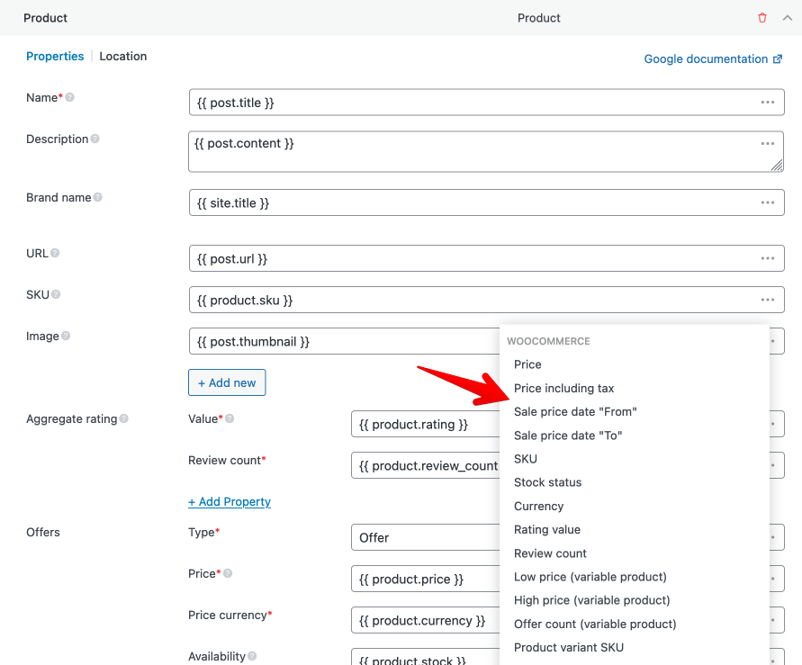
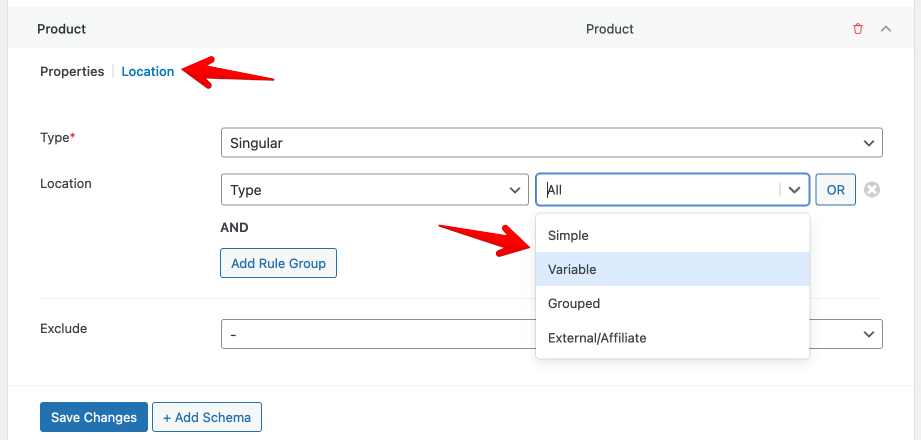

:::info
Slim SEO Pro **disables the default product schema from WooCommerce** and replaces it with a more complete version. It also adds many [dynamic variables](/slim-seo-pro/schema/dynamic-variables/) for products and provides location rules for product types.
:::

By default, WooCommerce outputs a very basic Product schema for simple and variable products. You can see it in [its source code](https://github.com/woocommerce/woocommerce/blob/trunk/plugins/woocommerce/includes/class-wc-structured-data.php).
This schema only includes the **product name, price, and reviews**.

That's a start, but it's far from enough. A proper [Product schema](https://schema.org/Product) can include much richer data, such as brand, color, size, logo, manufacturer, model, country of origin, or global identifiers. Sticking with WooCommerce's default schema means you're likely missing opportunities to rank better in search results.

## How Slim SEO Pro helps

Slim SEO Pro gives you full control over your Product schema:

- You can **fill in all the available Product schema properties**.
- You can also [connect Product schema to other schemas](/slim-seo-pro/schema/connecting-schemas/) to build a more detailed schema graph.



And yes, you can map WooCommerce product values to schema properties using [dynamic variables](/slim-seo-pro/schema/dynamic-variables/):



On top of that, Slim SEO Pro adds **location rules for product types**, so you can create different Product schemas and assign them to each product type:



## Connecting custom attributes for variable products

For variable products, Slim SEO Pro comes with built-in support for these attributes:

- `size`
- `color`
- `age`
- `suggested_age`
- `gender`
- `suggested_gender`
- `material`
- `pattern`

If you create product variations with any of these attributes, they will automatically appear in the dropdown list of suggested dynamic variables.

But what if you're using **custom attributes** not included in the list above? Don't worry - you can still connect them to Product schema properties manually. Just use this format:

```
{{ product.variants.attributes.name }}
```

Replace `name` with your custom attribute's name. Slim SEO Pro will parse your product variations and render the correct value in the schema.
