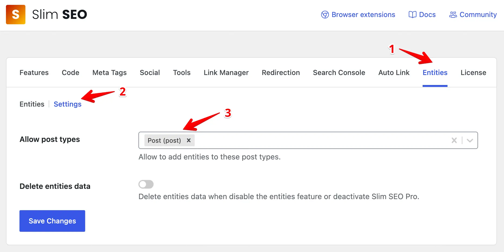
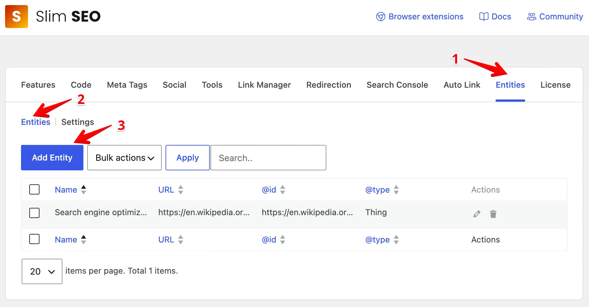
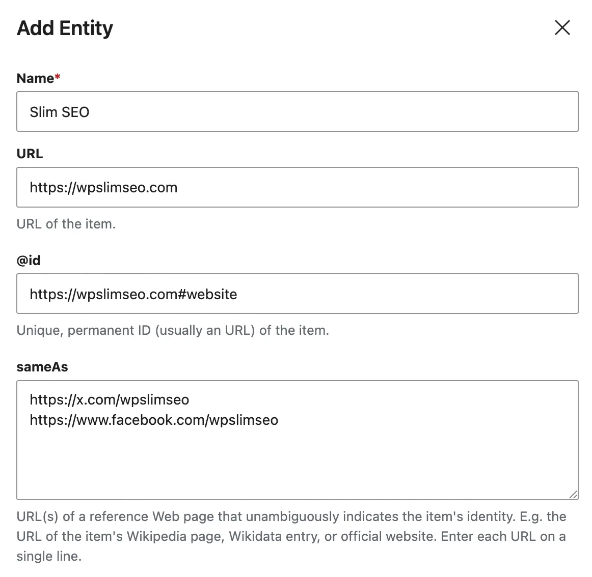
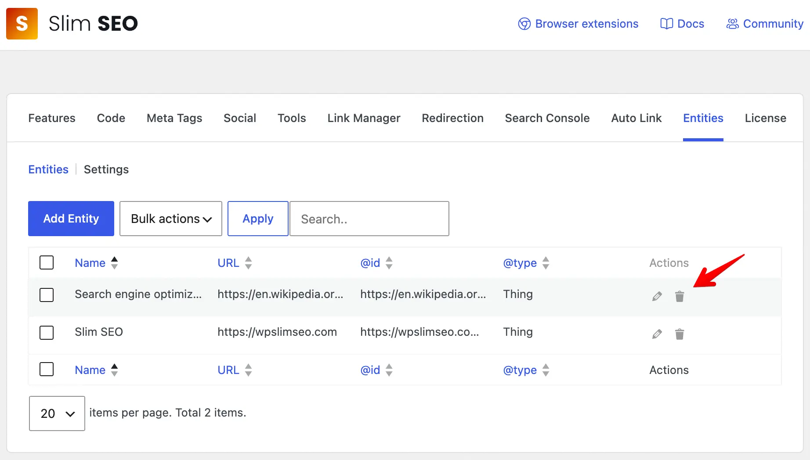
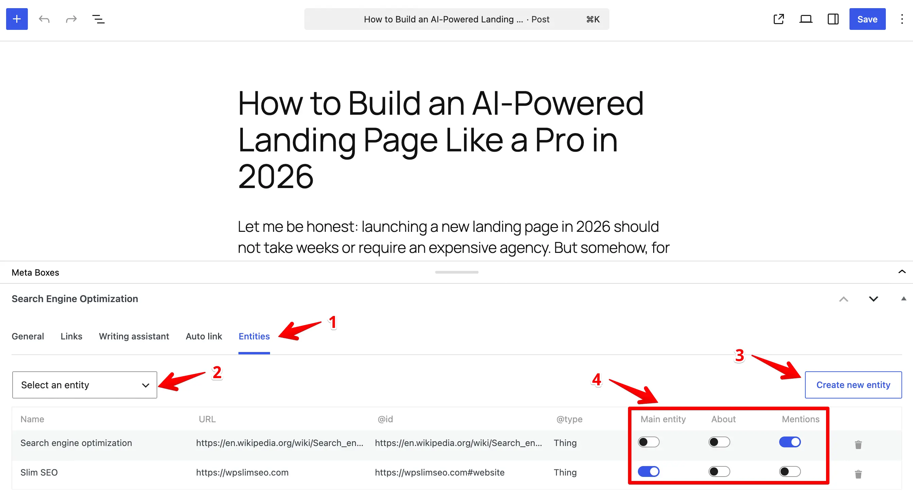
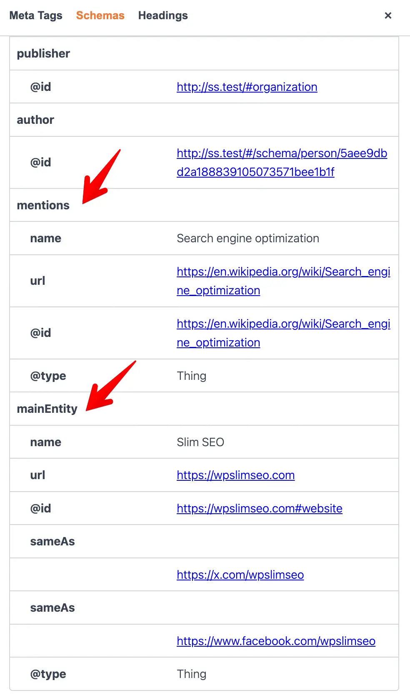

# Entities

Entities help search engines and AI assistants understand the **topics and concepts your content covers**. When you tag posts with the right entities, Google gets clearer context about what your content is about, and LLMs can cite and recommend it more accurately.

## What are entities?

An entity is a named concept, topic, or thing from `schema.org` that your content discusses. Think of them as tags with structure - not just keywords, but recognized concepts with a name, type, and optional metadata. For example:

- A technology like "React" or "Kubernetes"
- A product like "iPhone 16" or "Tailwind CSS"
- An industry topic like "serverless computing" or "accessibility"
- A concept like "technical SEO" or "Core Web Vitals"

Entities are not the same as your site's author or organization profile - that's what the [**Schema**](/slim-seo-pro/schema/adding-schemas/) feature handles (see below). Entities are about the *subjects* your content discusses.

## Why should you use entities?

**Clearer topic signals.** Instead of relying on keyword frequency, you explicitly tell search engines which concepts a post covers. This helps Google rank your content for relevant queries.

**Better AI citations.** LLMs like ChatGPT, Perplexity, and Google's AI Overviews use structured data to decide who and what to cite. Clear entity signals make your content a more reliable source - so when someone asks about a topic you cover, the AI is more likely to point to you.

**Consistent information.** Create an entity once (like a product or technology), then reuse it across dozens of posts without re-entering details.

**Richer search results.** Structured data can trigger enhanced results in Google - think knowledge panels, FAQ carousels, and sitelinks that make your listings more eye-catching and clickable.

## Getting started

### 1. Enable entities for post types

1. Go to **Slim SEO > Settings** in your WordPress admin.
2. Click the **Entities** tab.
3. Under **Allowed Post Types**, select which post types should show the Entities panel in the editor (e.g., Posts, Pages, or custom post types).
4. Save your settings.

Once enabled, you'll see an **Entities** tab in the editor for those post types.

### 2. Create your entities

Still in **Slim SEO > Settings > Entities**, click the **Add Entity** button to add a new entity.

Fill in the fields:

- **Name** - The entity's name (e.g., "Kubernetes", "Tailwind CSS", "Core Web Vitals").
- **URL** - The official page for this entity (e.g., the project homepage, Wikipedia page).
- **@id** - A unique identifier (URL or IRI) for this entity in structured data. Helps search engines connect mentions of this entity across your site.
- **Same as** - A list of related URLs (one per line), like official docs, Wikipedia, or social profiles.
- **Description** - A brief description of what this entity is.
- **Type** - The schema.org type. Defaults to `Thing`. Most topic entities work well as `Thing`, but you can use more specific types like `SoftwareApplication` or `People` if they fit.

Then click the **Add Entity** button to save the entity.

Repeat for each entity you want to create. You can always come back to edit or delete them later.

### 3: Attach entities to posts

1. Open any post or page to edit.
2. Click the **Entities** tab in the **Search Engine Optimization** meta box.
3. Browse or search your entity library and select the ones relevant to this content.
4. For each selected entity, assign its role:
   - **Main Entity** - The primary topic of the post. Only one entity can be the main entity. This becomes `mainEntity` in the structured data.
   - **About** - Topics the post covers in depth. These become the `about` property.
   - **Mentions** - Topics briefly referenced in the post. These become the `mentions` property.
5. Update the post.

### 4: Verify your structured data

After publishing, check that the structured data is rendering correctly:

1. Visit the published post on the front end.
2. View the page source and search for `"mainEntity"`, `"about"`, or `"mentions"` to confirm the entities appear in the JSON-LD script.

Or you can use our [browser extensions](https://wpslimseo.com/introducing-seo-analyzer-browser-extension/) to check the entities.

## How entities are attached to schema?

Entities are automatically injected into your post's existing JSON-LD output. You don't need to configure anything extra - once entities are assigned to a post, the plugin hooks into your active SEO plugin's schema filter and adds them.

The target schema type depends on which SEO plugin you use:

| SEO plugin | Schema type entities are attached to |
|------------|--------------------------------------|
| Slim SEO | Article |
| Slim SEO Pro | Article |
| Yoast SEO | Article |
| All in One SEO | BlogPosting |
| SEOPress | Article |
| The SEO Framework | Article |
| Squirrly SEO | Article |

In most cases, entities appear as `mainEntity`, `about`, or `mentions` properties inside the `Article` (or `BlogPosting`) schema. If no such schema exists on the page, entities won't be rendered - they require the article markup from your SEO plugin to attach to.

## Entities vs. Schema: when to use each?

Slim SEO Pro has two features for structured data - [**Schema**](/slim-seo-pro/schema/adding-schemas/) and **Entities**. They serve different purposes and work best together.

**Schema** creates the full JSON-LD markup for your site and content. It defines your site identity (WebSite, Organization, Person), page structure (WebPage, BreadcrumbList), and content type (Article). This is where you set up your company profile, author bios, and detailed organizational information. Think of it as the *foundation* - it tells Google what your site is and what kind of page this is.

**Entities** identify the topics and concepts a particular post covers. They attach to posts as relationships (`mainEntity`, `about`, `mentions`) and enrich the schema your site already outputs. Think of them as the *subject matter* - they tell Google what the content is about at a conceptual level.

**Use Schema when you want to:**
- Define your site-wide identity (Organization, Person)
- Add full markup (like article type, datePublished, author)
- Control the full structure of your JSON-LD output

**Use Entities when you want to:**
- Mark which topics or concepts a post discusses
- Indicate what a post is about vs. what it merely mentions
- Reuse the same topic entity across multiple posts without re-entering details

**Use both when:** You want the full picture. Schema handles the page-level and identity structure, and Entities adds the subject-level context. For example, Schema marks a page as an Article with author info, while Entities marks it as being *about* Kubernetes and *mentioning* Docker.

## FAQ

**Do I need to fill in every field?**

No. Only **Name** is required. Fill in the other fields as needed. The more details you provide, the more useful the structured data will be.

**What's the difference between "About" and "Mentions"?**

Use your best judgment. If a post goes deep on a topic (like a tutorial), assign it as **About**. If a topic is just referenced in passing, use **Mentions**.

**What happens if I delete an entity that's attached to posts?**

The post will no longer include structured data for that entity. You can reassign a different entity or leave the post without entity data.

**Can I use the same entity across multiple posts?**

Yes - that's the whole point. Create an entity once and attach it to as many posts as you like.

**Which SEO plugins are supported?**

Entities work with Slim SEO, Slim SEO Schema, Yoast SEO, All in One SEO, SEOPress, The SEO Framework, and Squirrly SEO. The plugin detects which one is active and hooks into the appropriate filter automatically.
