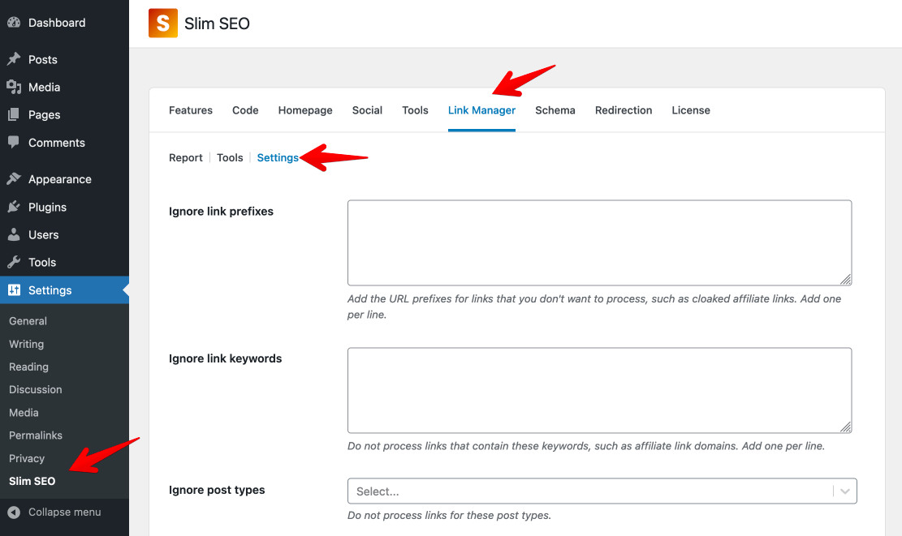
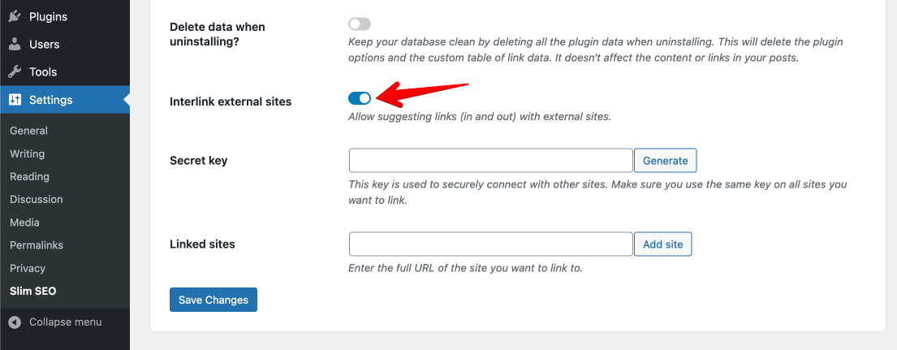
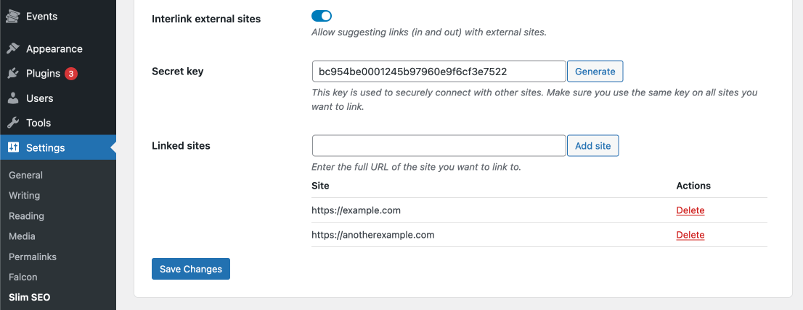
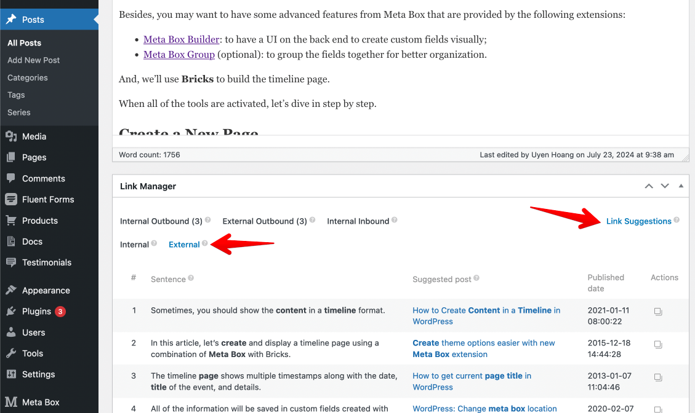
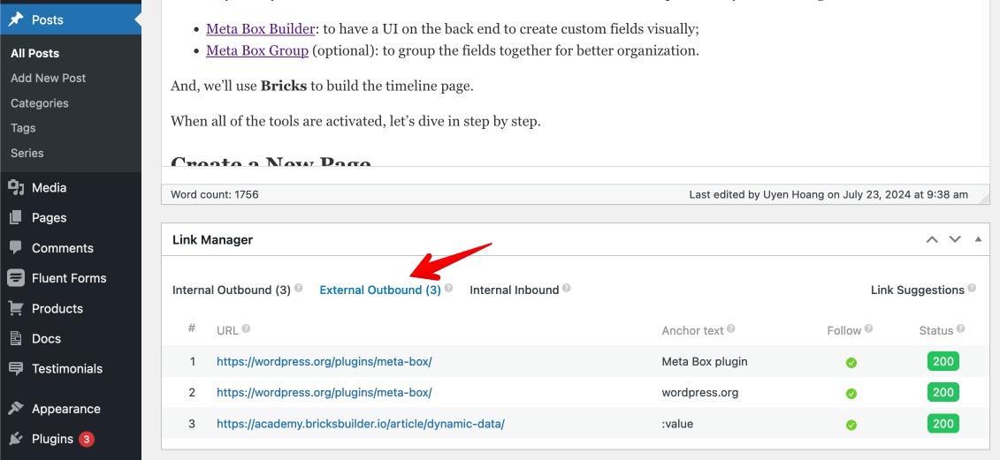
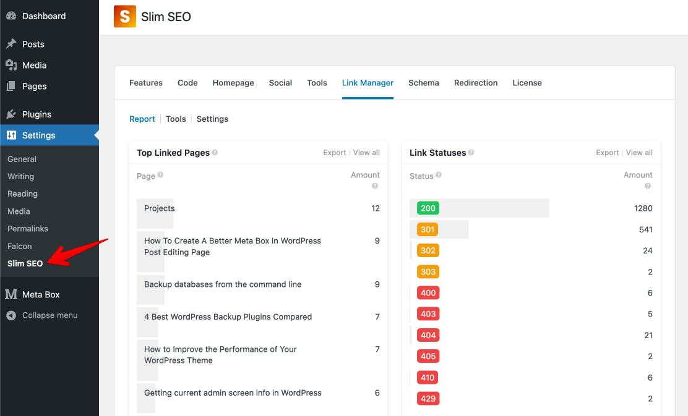

Besides [suggeting internal links](/slim-seo-pro/link-manager/link-suggestions/), Slim SEO Pro allows you to **build backlinks with external sites** of your network. So if you own a network of sites, then you can build backlinks from sites to sites. And plugin make this process easier by **suggesting and maintaining links automatically** for you.

## Enable interlinking external sites option

To start using this feature, go to **Slim SEO > Link Manager > Settings**:

Scroll down and enable the **Interlink external sites** option:

The plugin will reveal two more options:

- **Secret key**: this is the key used to connect with other sites securely. All the sites that are linked together must use the same key.
- **Linked sites**: this is the list of the sites that are linked to from the current site.

### Generating secret key

The next step is generating a secret key. To do that, click the **Generate** button. The plugin will create a key for you and fill in the input.

:::caution Save the key before continuing

**Make sure you save the plugin settings** by clicking the **Save Changes** button. Otherwise, the secret key is not saved yet, and this feature won't work.

:::

This secret key is used to connect with your other sites securely, so keep it secret and don't share it anywhere. Otherwise, if hackers know this key (and your license key), they can connect to your website and get data.

Also note that this key **must be the same on the sites that you want to connect**. So after generating a key on one site, go to other sites and enter it in this setting. Then save the changes.

### Adding sites

After having a secret key for all sites, then you need to connect them together. In the next option **Linked sites**, you'll see an input to enter the other sites' URLs. Make sure you enter the full URL of the site, including `https://`. After that click the Add site button.

The plugin will connect to the newly added site, using the secret key to verify the connection. When everything is finished, the new site will be shown in the table below.

That's done the setup part for interlinking external sites. To see it in action, let's go to edit a post and see [how the plugin suggests links](/slim-seo-pro/link-manager/link-suggestions/) from other sites.

## Suggesting links from external sites

To build backlinks between sites, Slim SEO Pro will suggest links to other sites when you edit a post or a page. This way, you can link from your current post or page to a related or relevant post on other sites.

To do that, go to edit a post, and in the **Link Manager** meta box, below the post content, click **Link Suggestions** and you'll see two new options: **Internal** and **External** tabs as follows:

Where:

- **Internal**: it's the link suggestions within your site, e.g. the suggestions to link to posts and pages on your site. It's the functionality that has been in the plugin since the beginning.
- **External**: this is the new feature that suggests links from posts or pages on other websites.

When clicking the **External** tab, the plugin will show you a table of the related or relevant posts that it found on other websites. You can also see which sentence relates to the post, and if you feel okay, you can click the **Copy** button (in the **Actions** column) to copy the link to insert into your content.

After doing that, you'll see the new links appear in the **External Outbound** [report](/slim-seo-pro/link-manager/post-links/):

Of course, those links will be available in the plugin's [reports](/slim-seo-pro/link-manager/reports/) under **Slim SEO > Link Manager**, so you can see all the available details about them, like status, anchor text, etc.

Now you can monitor those links easily to see which links are redirected, which ones are broken, and can fix them.

## Auto update links between sites

Besides suggesting and monitoring links to external sites, Slim SEO Pro also helps you to **maintain those links**, to keep them always active. That means when you edit and update a permalink of a post on one site, **all the links to that post on other connected sites will be updated automatically**. This keeps the URL always fresh, correct and avoids broken or redirected links across your sites, which is quite hard to track and fix.

## Multisite network

If you use a multisite network, the plugin also optimizes the performance a lot to reduce the external connections. But in any case, performance is our top priority and this functionality doesn't affect it. It's just better in the case of multisite versus multiple external sites.