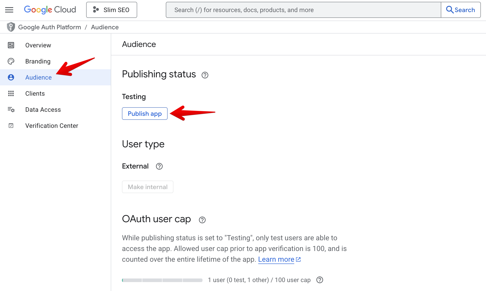

Analytics is a pro feature that allows you to connect to Google Search Console (GSC) to bring the reports to WordPress. It helps you see how your pages perform on SERP, and give you more info about your impressions, positions, CTR, and keywords.

To connect your site with Google Search Console, the plugin uses the official Google OAuth2 SDK for authorization. This is the standard and recommended method provided by Google. With this setup, you'll need a Google account and a project in Google Cloud Console. By creating your own app, you maintain full control and ownership of your data. Some third-party services let you connect through their Google app instead. However, this gives them access to your site's data, which can pose security and privacy risks.

Let's get started!

## Creating a project

Go to [Google Cloud Console](https://console.cloud.google.com/) and log in with your Google account. If you don't already have a project to use for the integration with Slim SEO Pro, create a new one by selecting the project dropdown menu at the page's top-left corner, near the Google Cloud logo, and in the popup, click the **New Project** button:

On the next screen, enter the project name. It can be anything:

## Enabling API

After creating the project, select the project from the dropdown menu at the page's top-left corner, near the Google Cloud logo.

Then in the search box, enter "Google Search Console API" to search the API we need to enable, and select the first option:

On the next screen, click **Enable** button to enable the API.

## Configuring the consent screen

The app created in the previous step requires your permission to connect to your Google Search Console account. The steps below will let you know how to configure the screen for asking your permission (the consent screen).

### Branding

When connecting to Google Search Console, an authorization screen will appear and ask for your permission to access to GSC data. We need to configure the branding for that screen.

From the sidebar menu, select [**OAuth consent screen**](https://console.cloud.google.com/auth/overview):

Then [select the **Branding** menu](https://console.cloud.google.com/auth/branding):

Enter your information by following their instruction:

### Audience

Now [go to the **Audience** tab](https://console.cloud.google.com/auth/audience) and click the **Publish app** button:

## Creating credentials

[Go to **Credentials** tab](https://console.cloud.google.com/apis/credentials) and click the **+ Create credentials** button at the top, then select **OAuth client ID**:

Select **Web application** in the **Application type** dropdown and enter `https://yourdomain.com/?ssp_gsc_callback=1` (replace `yourdomain.com` with your actual domain) in the **Authorised redirect URIs**:

:::info

If you want to use Slim SEO Pro for multiple websites, you don't need to create multiple projects and go throught these settings from the beginning. Instead of that, just add more authorised redirect URIs here.

:::

Then click **Create** button to create the credentials. After finishing, you'll see **Client ID** and **Client Secret** in the popup:

Copy these details and now go to your **WordPress admin > Settings > Slim SEO > Analytics tab > Settings** and enter the details:

## Authorizing with GSC

After entering the client ID and client secret for GSC, you can connect to GSC to get the reports. To connect to GSC, click the link in the dashboard:

then login with the your Google account:

After all these steps, it will redirect you back to Analytics and ready for you to use:

Now it's time to [learn about the reports](/slim-seo-pro/analytics/reports/).
