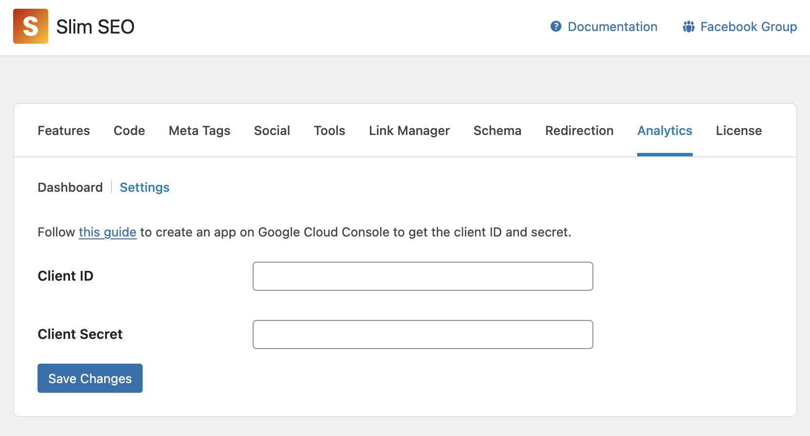

Analytics is a pro feature that allows you to connect to Google Search Console (GSC) to bring the reports to WordPress. It helps you see how your pages perform on SERP, and give you more info about your impressions, positions, CTR, and keywords.

To connect to Google Search Console, follow these steps:

## Creating a project on Google Cloud

Go to [Google Cloud Console](https://console.cloud.google.com/) and log in with your Google account. If you don't already have a project to use for the integration with Slim SEO Pro, create a new one by selecting the project dropdown menu at the page's top-left corner, near the Google Cloud logo, and in the popup, click the **New Project** button:

On the next screen, enter the project name. It can be anything:

## Enabling API

After creating the project, select the project from the dropdown menu at the page's top-left corner, near the Google Cloud logo.

Then in the search box, enter "Google Search Console API" to search the API we need to enable, and select the first option:

On the next screen, click **Enable** button to enable the API.

## Creating branding

When connecting to Google Search Console, an authorization screen will appear and ask for your permission to access to GSC data. We need to configure the branding for that screen.

From the sidebar menu, select **OAuth consent screen**

Then select Branding on the menu:

Enter your information by following their instruction:

## Adding authorised domain

This step ensures the app runs only for your domain. Click **Branding** menu again, and scroll down to see the new input for authorised domains. Simply add your domain(s) here:

## Setting up audience

This step tells Google that your app is a public app, which can be used by other users or a test app, which is used by yourself only. Click the **Audience** menu, and you'll see by default, the app is **Testing**. This is our recommend mode to use as the app is for your websites only. It's not a public app for others.

:::caution

If you want to keep the app in the testing mode, **do NOT** click the **Publish app** button.

:::

When keeping the app in the testing mode, you will have to add test users. Scroll down to the **Test users** section and click **+ Add user** button.

In the popup, add your email and click **Save** button:

## Creating credentials

Go to **Credentials** tab and click the **+ Create credentials** button at the top, then select **OAuth client ID**:

Select **Web application** in the **Application type** dropdown and enter `https://yourdomain.com/?ssp_gsc_callback=1` (replace `yourdomain.com` with your actual domain) in the **Authorised redirect URIs**:

Then click **Create** button to create the credentials. After finishing, you'll see **Client ID** and **Client Secret** in the popup:

Copy these details and now go to your **WordPress admin > Settings > Slim SEO > Analytics tab > Settings** and enter the details:

## Authorizing with GSC

After entering the client ID and client secret for GSC, you can connect to GSC to get the reports. To connect to GSC, click the link in the dashboard:

then login with the account that you used for test users in the step above:

After all these steps, it will redirect you back to Analytics and ready for you to use:

Now it's time to [learn about the reports](/slim-seo-pro/analytics/reports/).