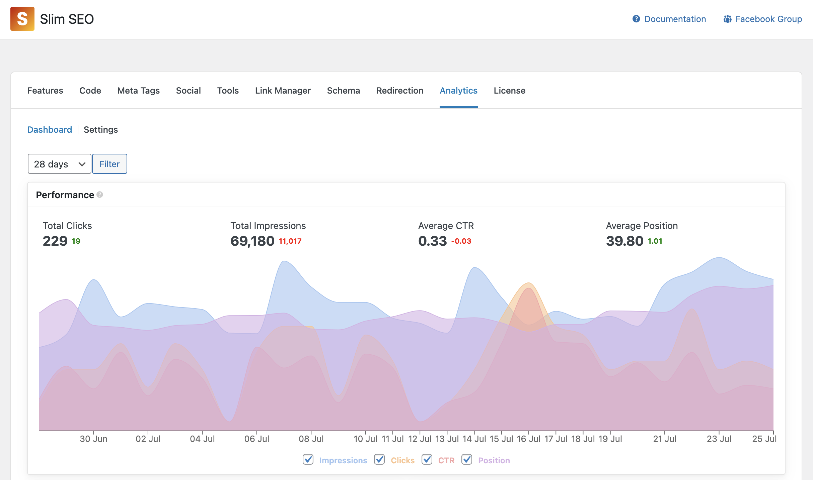
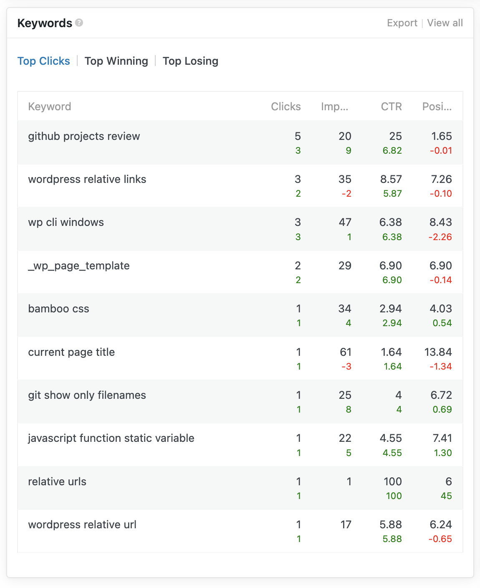
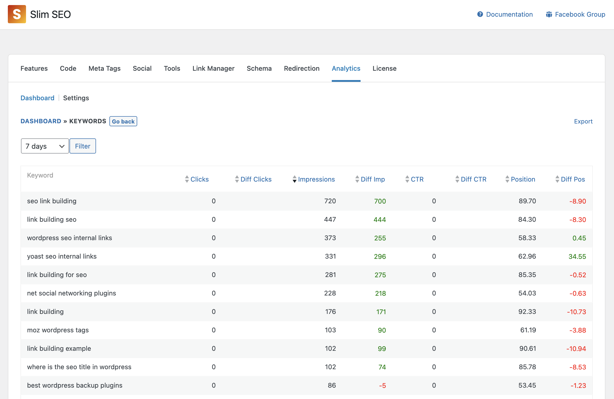
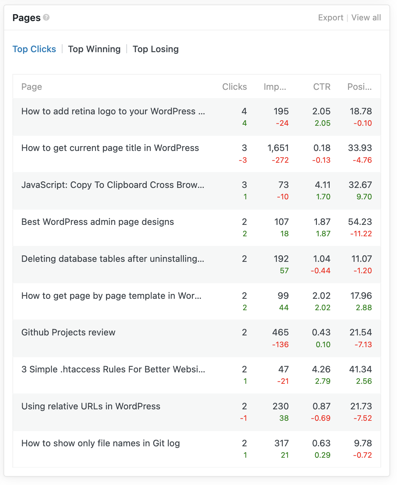
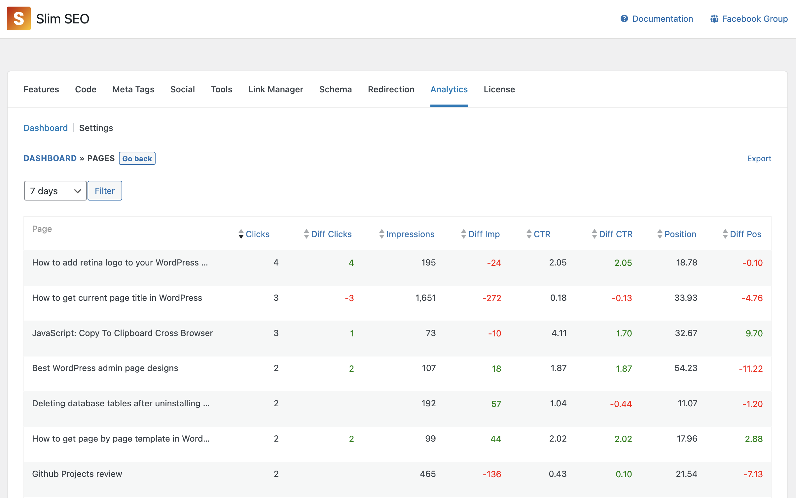

The integration with Google Search Console (GSC) allows Slim SEO Pro to pull the reports from GSC into WordPress admin so you can see your search performance faster. The reports shown by Slim SEO Pro is a little bit different from the default GSC reports as we re-organize them so you can view import metrics faster.

## Performance

The 1st and the most important report is the **Performance** report. This report shows you how your pages perform on SERPs:

It has the following metrics:

- Total Impressions: how many times your pages appear on SERPs
- Total Clicks: how many times people click to go to your pages
- Average CTR: the average ratio between clicks and impressions
- Average Position: the avarage position of your pages on SERPs

You can toggle each metric by check/uncheck the checkbox below the graph, or filter the date from the dropdown at the top of the graph.

Basically, this report is the same as the original **Performance** report in GSC.

## Keywords

The 2nd report is the **Keywords** report, which shows you the keywords that you rank for:

Slim SEO Pro groups keywords into 3 tabs and put them at the top of the table

- Top Clicks: keywords that get most total clicks
- Top Winning: keywords that get more clicks than the previous period
- Top Losing: keywords that lose more clicks than the previous period

In the table, you'll see each keyword with the same metrics as in the **Performance** report. However, to let you know the changes/differences from the current period to the previous period, we added secondary numbers below the primary numbers, with color = green if increased and red if decreased.

To view more details about each keywords, click the **View all** link at the top right of the widget, and you'll redirect to the detailed page:

In this screen, you can see the metrics clearer, and sort keywords by them.

You can also export the keywords to CSV to do further analyzing if you want.

## Pages

The 3rd report is the **Pages** report, which shows you how your pages perform on SERPs. It's useful to know the performance of each individual page on your website.

Similar to the **Keywords** report, we also group pages into 3 tabs:

- Top Clicks: pages that get most total clicks
- Top Winning: pages that get more clicks than the previous period
- Top Losing: pages that lose more clicks than the previous period

In the table, you'll see each page with the same metrics as in the **Performance** report. However, to let you know the changes/differences from the current period to the previous period, we added secondary numbers below the primary numbers, with color = green if increased and red if decreased.

To view more details about each page, click the **View all** link at the top right of the widget, and you'll redirect to the detailed page:

In this screen, you can see the metrics clearer, and sort pages by them.

You can also export the report to CSV to do further analyzing if you want.