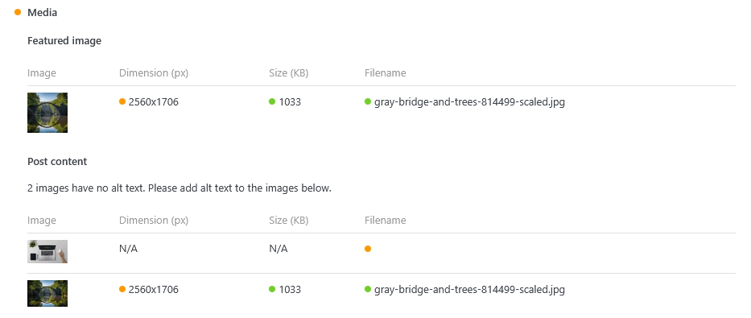

The **Writing Assistant** feature analyzes your content in real time to help you create SEO-optimized posts and pages. It provides instant feedback on keywords, readability, content structure, and media optimization, helping you improve quality and search engine rankings.

## Where to Find It

If you use **Slim SEO Free**, you'll see the **Writing Assistant** tab in the **Search Engine Optimization** meta box when editing a post or page:

If you don't use **Slim SEO Free**, you'll see the **Writing Assistant** meta box instead:

:::info
Just a reminder that you can use [Slim SEO Pro](https://wpslimseo.com/products/slim-seo-pro/) with or without Slim SEO Free.

- **Slim SEO Free** includes a complete set of basic SEO features.
- **Slim SEO Pro** offers additional premium SEO features *not included in Slim SEO Free*.

For the best results and the full feature set, install and use both plugins together.
:::

## How It Works

The Writing Assistant offers suggestions to help you improve your content. These are **opinionated recommendations**, not strict rules you must follow. Think of it as an assistant providing feedback to enhance your writing.

## Recommendations

Below is the full list of recommendations. Each has a colored indicator in its title:
- **Orange**: Needs improvement
- **Green**: No issues detected

Click a section title to expand details, including explanations and specific issues to address.

### Keywords

Keywords are the first element analyzed (see the screenshot above). Slim SEO Pro lets you enter **multiple keywords** and evaluate them against your content.

In the **Keywords** section:
- Enter your target keywords, separate multiple keywords with commas or press **Enter**.
- Mark one keyword as your **Main keyword** using the toggle switch.

For each keyword, the plugin checks:

- **Keyword density**: Counts how often and how many times a keyword appears. A density between **0.5% and 3%** is recommended. Lower values mean the keyword may not be a topic of the article, while higher values may appear spammy.
- **Keyword placement**: Checks if the keyword appears in the title, slug, meta description, intro paragraph, headings, and image alt text - important locations for signaling your topic to readers and search engines.

### Media

This section analyzes your featured image and any images within your content.

- **Featured image**: Warns if no featured image is set.
- **Post images**: Warns if images are missing alt text.

It also evaluates each image for:

- **Dimensions**: Warns if width exceeds 1920px (suitable for most screens).
- **File size**: Warns if the image is larger than 2MB, to ensure fast loading.
- **Filename**: Warns if filenames contain special characters. Use meaningful, descriptive names, and consider adding keywords. (This check is advisory and not enforced strictly.)

### Word Count

Tracks total word count, including image alt text. We recommend writing **at least 500 words** to avoid thin content, which can hurt SEO.

### Internal Links

Counts internal links to other posts or pages. Adding internal links can:

- Help readers find related and useful content
- Assist search engines in understanding your content's context
- Help search engines discover new posts
- Pass link juice to other pages
- Demonstrate expertise, boosting your authority

This is a quick overview. For detailed link analysis, use the [Link Manager](/slim-seo-pro/link-manager/post-links/) module, which provides:

- **Internal outbound links**: From this post to other posts
- **Internal inbound links**: From other posts to this one
- **External outbound links**: From this post to other websites
- [**Link suggestions**](/slim-seo-pro/link-manager/link-suggestions/): Related content suggestions for internal linking

### Slug

The slug is an important SEO element. We check slug length and recommend keeping it under **5 words** for better readability.

:::info

Note that keyword inclusion in slugs is already checked in the **Keywords** section.

:::

### Readability (English Only)

We assess content readability using the [Flesch–Kincaid readability tests](https://en.wikipedia.org/wiki/Flesch%E2%80%93Kincaid_readability_tests).

**Score ranges**:

- 90-100: Very easy to read
- 80-89: Easy to read
- 70-79: Fairly easy to read
- 60-69: Okay to read
- 50-59: Fairly difficult to read
- 30-49: Difficult to read
- 0-29: Very difficult to read

If your content scores low, try:

- Shortening sentences, especially for complex topics
- Breaking up long paragraphs
- Avoiding unnecessary jargon

### Paragraphs

Checks paragraph length for optimal readability.

**Recommendations**:

- **Minimum**: 2 sentences per paragraph (avoid single-sentence paragraphs)
- **Maximum**: 10 sentences per paragraph (too long is harder to read)
- **Maximum words**: 200 words per paragraph

Now you're ready to create content that's both useful and optimized for SEO!
