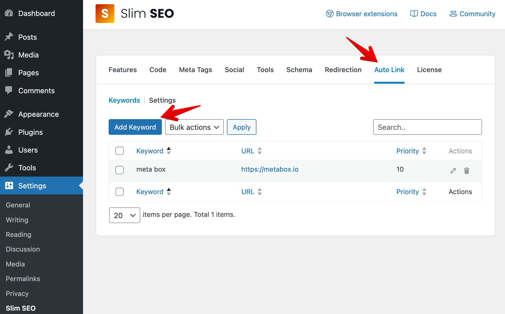
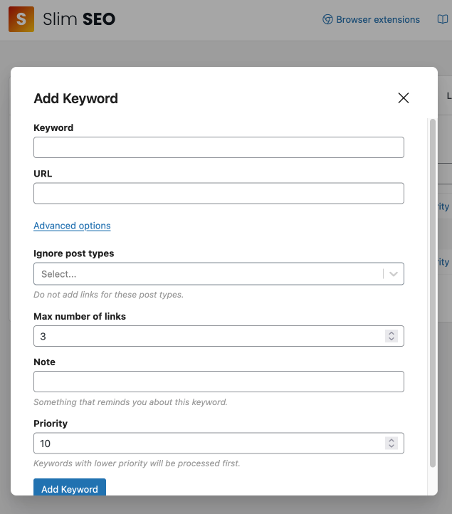
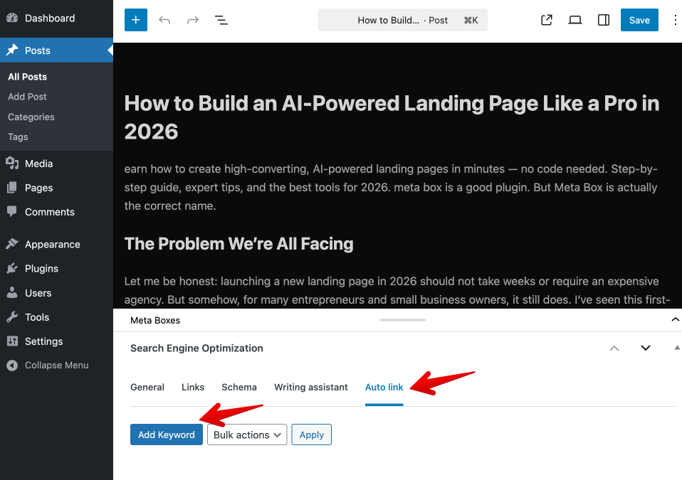
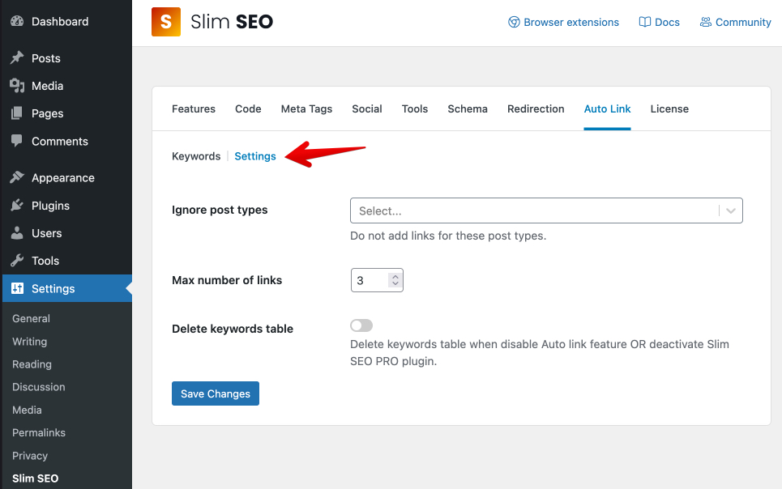

**Auto Link** is a feature that automatically scans your post/page content and turns matching keywords into links. This helps you add consistent links across your site without manually inserting links every time.

## Global keywords

Global keywords are keywords that are used across your entire site. To add a global keyword, follow these steps:

1. Go to **Settings → Slim SEO → Auto Link** tab.
2. Open the **Keywords** tab.
3. Click **Add Keyword**.

A popup will appear with the following options:

Option|Description
---|---
Keyword|The word or phrase you want Auto Link to find in your content.
URL|The destination link for that keyword.
Ignore post types|Do not add links for this keyword when viewing these post types.
Max number of links|The maximum number of links Auto Link will create for this keyword in a single piece of content.
Note|A private note to help you remember what this keyword is for.
Priority|Controls the order keywords are processed. Keywords with higher priority are processed first.

:::info

- Matching is case-insensitive. For example, `WordPress` and `wordpress` are treated the same.
- A keyword must be unique. You can't register the same keyword twice with different URLs.

:::

On this page, you can edit or delete keywords.

- To edit a keyword, click the **Edit** (pencil) icon.
- To delete a keyword, click the **Trash** icon.
- To delete multiple keywords at once:
  - Select keywords using the checkboxes
  - Choose **Bulk actions → Delete**
  - Click **Apply**

## Per-post keywords

Per-post keywords are keywords that are used only for a specific post/page. It's useful when you want a keyword to link to the current post/page's permalink.

To add a per-post keyword, follow these steps:

1. Go to **Posts/Pages → Edit Post/Page**.
2. In the **Search Engine Optimization** meta box, open the **Auto link** tab.
3. Click **Add Keyword**.

A popup will appear with similar options as the global keywords, except for the **URL** which will be the current post/page permalink.

## Settings

These settings apply across your site. You can view them in the **Settings → Slim SEO → Auto Link** tab, and select the **Settings** sub-tab.

Option|Description
---|---
Ignore post types|Do not add links for these post types.
Max number of links|The default maximum number of links for each keyword in a single post/page.
Delete keywords table|If enabled, Auto Link keyword data will be removed when the Auto Link feature is disabled or Slim SEO Pro is deactivated.

## How does it work?

- Auto Link scans only your post/page **content** (the main content area).
- When it finds a matching keyword, it replaces that keyword with a link to the URL you set.

:::caution

- **Content only:** Auto Link runs only on the post/page content, not on other areas like excerpts or widget text.
- **Unique keywords:** Because each keyword can only be registered once, you can't use the same keyword for multiple URLs.

:::

## Troubleshooting

### The keyword is not being linked

- Make sure the keyword is added in Auto Link and the URL is valid.
- Check that the current content type is not excluded in **Ignore post types** (either globally or in the keyword's advanced options).

### I can't add the same keyword twice

This is expected. Each keyword must be unique, so Auto Link always knows which URL to use.
