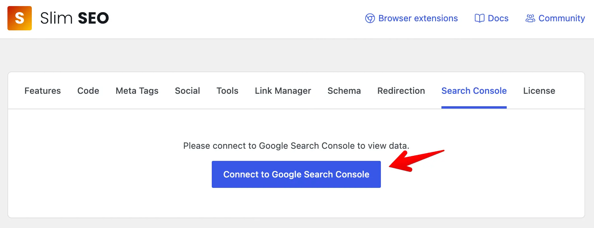
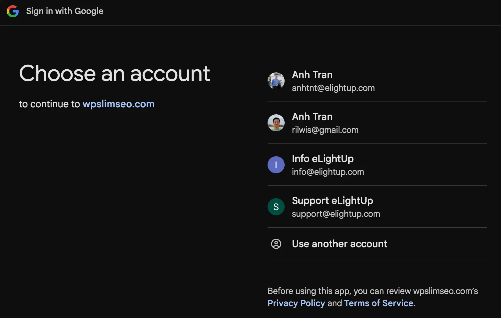
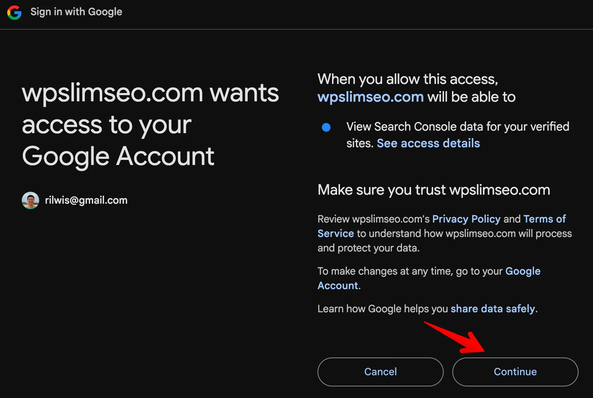
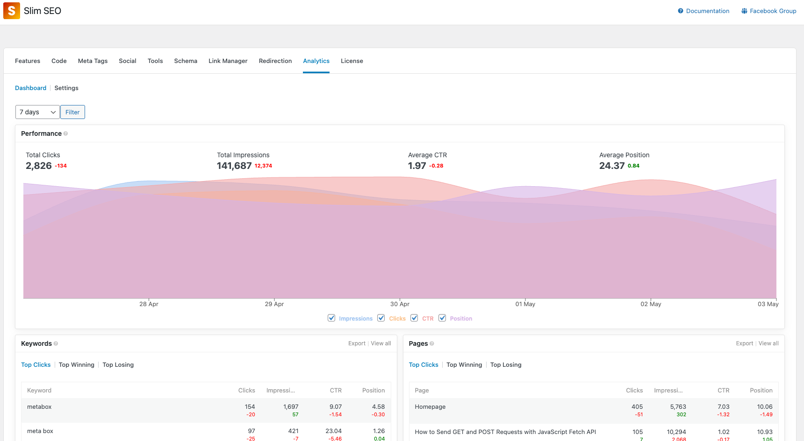

Slim SEO Pro connects your site to Google Search Console (GSC) and shows the reports in WordPress. You can see how your pages perform in the search results, with details about impressions, positions, CTR, and keywords.

Slim SEO Pro uses its own OAuth application to authorize with Google. You do not need a Google Cloud project, an OAuth client, or credentials. You only need a Google account and a site in your Google Search Console.

## Connecting to Google Search Console

Step 1: Go to **WordPress admin > Slim SEO > Search Console tab**.

If you have not connected to GSC yet, you will see a message that asks you to connect:

Step 2: Click the link to connect to Google Search Console.

The plugin redirects you to Google to authorize with your Google account:

Step 3: Grant the plugin permission to view your Search Console data:

The plugin redirects you back to the Search Console tab. You can now view your reports:

:::info

To use Slim SEO Pro for multiple websites, repeat the steps above for each website. You can connect all websites with the same Google account.

:::

Learn about the [reports](/slim-seo-pro/search-console/reports/).
