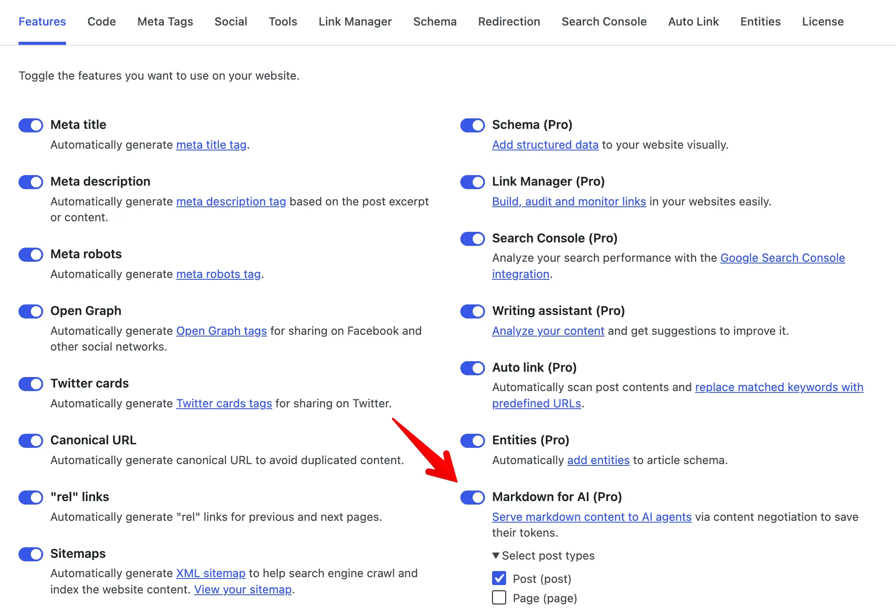

**Markdown for AI** serves your post content as Markdown when an AI agent asks for it. Browsers still get the normal HTML page, while AI tools get a clean Markdown copy of the same URL.

The feature uses HTTP content negotiation: the agent sends an `Accept: text/markdown` header, and Slim SEO Pro returns Markdown instead of HTML. The canonical URL does not change, so you do not need a separate `.md` URL.

## Why Markdown for AI matters

AI agents fetch your pages to answer questions and cite sources. A normal HTML response includes navigation, scripts, ads, and layout wrappers, so the agent must dig through that noise to reach your content.

Markdown drops the chrome and keeps the article structure (headings, links, lists, tables, and code). That cuts tokens, improves retrieval quality, and speeds up agent responses, while humans still get the normal HTML page.

## How it works

The feature runs only on **singular** posts (and other singular content of the post types you select). It does not run on archives, the home page, search results, feeds, previews, or password-protected posts.

When a client requests a singular post URL with `Accept: text/markdown` in the request header, Slim SEO Pro returns the post as Markdown. If that header is missing or prefers HTML, the normal theme page loads.

HTML and Markdown share the same post URL. AI agents such as Claude Code or Cursor only need to send the `Accept: text/markdown` header. They do not need a second URL that ends with `.md`.

The plugin also sends `Vary: Accept`, so caches and CDNs can store HTML and Markdown as separate variants of the same URL.

Markdown responses skip the page cache (`DONOTCACHEPAGE`). The URL alone cannot tell Markdown from HTML, so this avoids a shared cache entry that serves the wrong format.

## Enable Markdown for AI

1. Go to **Settings → Slim SEO → Features**.
2. Turn on **Markdown for AI (Pro)**.
3. Open **Select post types** under that feature.
4. Select the post types that must serve Markdown (for example, Posts or Pages).
5. Click **Save Changes**.



By default, the feature is on for the `post` post type.

## What the Markdown contains

Each Markdown response has two parts:

1. **YAML front matter** with post metadata
2. **Body** converted from the post content

Front matter fields:

| Field | Meaning |
| --- | --- |
| `title` | Post title |
| `url` | Permalink |
| `date` | Publish date (ISO 8601) |
| `modified` | Last modified date (ISO 8601) |

Example:

```markdown
---
title: "How to install Slim SEO Pro"
url: "https://example.com/install-slim-seo-pro/"
date: "2026-08-01T10:00:00+00:00"
modified: "2026-08-07T08:30:00+00:00"
---

## Installation

1. Download the plugin zip file.
2. Upload and activate it in WordPress.
```

The body comes from the post content after blocks and shortcodes render. The plugin converts HTML to Markdown, strips script and style tags, and cleans code blocks so fenced code stays readable. Tables convert to Markdown tables when possible.

## Test the response

Run this command against a published post URL:

```bash
curl -sI -H "Accept: text/markdown" https://example.com/your-post/
```

Make sure that the response includes:

- `Content-Type: text/markdown`
- `Vary: Accept`

Then fetch the body:

```bash
curl -s -H "Accept: text/markdown" https://example.com/your-post/
```

You must see YAML front matter and Markdown content. If you send `Accept: text/html`, or omit Markdown from `Accept`, you get the normal HTML page.

You can also use [acceptmarkdown.com](https://acceptmarkdown.com/) to score a URL for Markdown content negotiation.

## FAQ

**Do browsers see Markdown?**

No. Browsers send `Accept` headers that prefer HTML, so they keep getting the normal page. Only clients that prefer `text/markdown` get Markdown.

**Do I need a `.md` URL?**

No. Slim SEO Pro serves Markdown on the canonical post URL when the `Accept` header asks for it.

**Does this change SEO for Google?**

Search crawlers that request HTML still get HTML. The feature targets AI agents that ask for Markdown, and your public HTML page and canonical URL stay the same.

**What if my cache or CDN ignores `Vary: Accept`?**

Markdown responses set `DONOTCACHEPAGE` so common WordPress page caches skip them. If a CDN caches HTML and Markdown under one key and ignores `Vary`, configure the CDN to respect `Vary: Accept`. You can also exclude those URLs from the edge cache for agent traffic.

**Can I enable Markdown for custom post types?**

Yes. Select them under **Select post types** on the Features tab.
