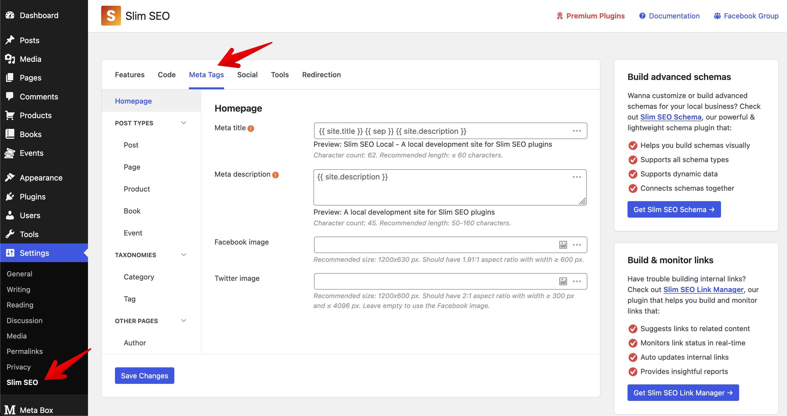
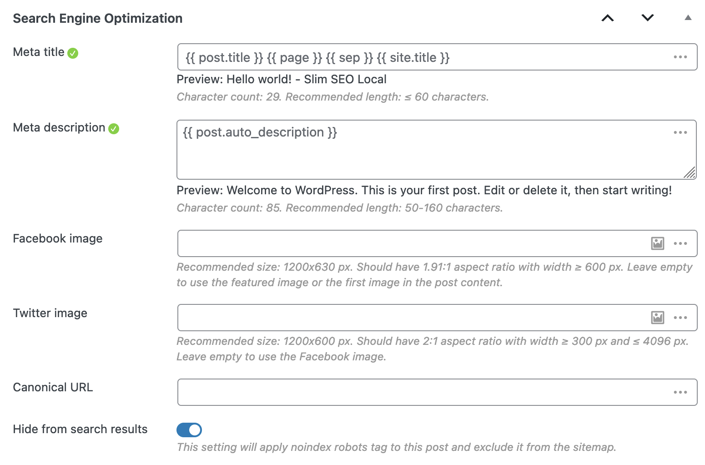

You do not need to configure the meta title tag. WordPress already has this feature! All we need to do is add theme support for `title-tag`.

```php
add_theme_support( 'title-tag' );
```

We already do that hundreds of times while coding themes. And WordPress does its job pretty well.

So, with Slim SEO, this feature is automatically enabled.

The title tag will have the following format:

- For homepage: Site title - Site description.
- For singular pages/posts: Page/Post title - Site title.
- For other pages: Page title - Site title.

## How to set up meta title for post types and taxonomies?

If you want to set up meta title format for custom post types, go to **Settings > Slim SEO** and select the **Meta Tags** tab. There you will see a list of available post types and taxonomies, and you can configure the meta tags for them.



The plugin provides dynamic variables to help you configure the meta tags easier. Please refer to [this docs](/slim-seo/dynamic-variables/) for more details.

## How to change meta title manually?

If you want to set a custom meta title for a specific post or term, simply enter the text in the **Search Engine Optimization** meta box below the content area:



You will see the status icon showing if the description has a good length. The meta title should not be longer than **60 characters**. You can also use [dynamic variables](/slim-seo/dynamic-variables/) here.

:::tip Shortcodes are allowed

Slim SEO supports shortcodes in the meta title and meta description. You can add your own shortcodes here to output your custom dynamic content.

:::

:::caution Manual meta title

When you enter the manual meta title, it will be used as it is. It will not be appended with the site title.

:::

:::caution Homepage settings

If you set your homepage as a static page, then the plugin treats it like a normal page. SEO settings for the homepage will not be available in the plugin settings (**Settings > Slim SEO**). Instead, they will be available below the editor when you edit the homepage.

:::

## How to change the meta title with code?

If you want to change the title, use the `slim_seo_meta_title` filter.

The following code changes the meta title for a single post with ID = 24. The title is get via a custom field:

```php
add_filter( 'slim_seo_meta_title', function( $title, $object_id ) {
    if ( get_post_type( $object_id ) === 'movie' ) {
        $title = get_post_meta( $object_id, 'movie_title', true );
    }
    return $title;
}, 10, 2 );
```

Note that using the filter will have the highest priority. For example, it will overwrite the meta title you enter manually. To avoid that, you can check if the post has a manual meta title and change the title only when it does not:

```php
add_filter( 'slim_seo_meta_title', function( $title, $object_id ) {
    if ( get_post_type( $object_id ) === 'movie' ) {
		// Detect if a single post has manual meta title.
        $meta = get_post_meta( $object_id, 'slim_seo', true );
        if ( ! empty( $meta['title'] ) ) {
            return $meta['title'];
        }

		$title = get_post_meta( $object_id, 'movie_title', true );
    }

    return $title;
}, 10, 2 );
```

## How to change the separator in the meta title?

By default, WordPress uses a dash (-) as the separator in the meta title. To change that, use this snippet:

```php
add_filter( 'document_title_separator', function() {
    return '|'; // Replace with your custom separator.
} );
```

## How to hide SEO columns

By default, the plugin shows custom meta title and meta description in the admin post and term table. There are two ways to hide these columns:

### Toggle the screen options

Click the **Screen Options** button at the top right corner of the screen and toggle the checkboxes for Meta title and Meta description:


This way, you show or hide the columns for the current user only. It is not applied to all users.

### Hide the columns with code

To hide the columns completely for all users, use this snippet:

```php
add_filter( 'slim_seo_admin_columns_post', '__return_empty_array' );
add_filter( 'slim_seo_admin_columns_term', '__return_empty_array' );
```

## How to hide SEO settings meta box for non-admin users?

In some cases, where you want only admins to change the meta title, meta description or other SEO settings, use this snippet to hide the SEO settings meta box from other user roles:

```php
// Hide SEO settings meta box for posts.
add_filter( 'slim_seo_meta_box_post_types', function ( $post_types ) {
	return current_user_can( 'manage_options' ) ? $post_types : [];
} );

// Hide SEO settings meta box for terms.
add_filter( 'slim_seo_meta_box_taxonomies', function ( $taxonomies ) {
	return current_user_can( 'manage_options' ) ? $taxonomies : [];
} );
```

:::caution

Please note that if the SEO settings meta box is hidden, then users will not see the SEO columns in the post or term list table neither.

:::
