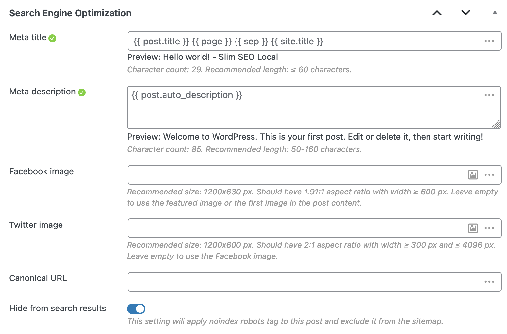

The meta description tag is automatically generated from the post/page excerpt or post/page content (in case you don't enter an excerpt).

Note that WordPress doesn't support excerpt for pages. Slim SEO fixes this by adding excerpt to pages, so you can enter custom excerpt for pages.

- For homepage, if you set it as a static page, then the plugin treats it like a normal page.
- For categories, post tags or custom taxonomies, their description will be used as meta description. Edit these by visiting the post type of your choice and selecting your desired taxonomy. The Slim SEO metabox is found at the bottom of the page. Example: Posts > Categories/Tags, Products > Categories/Tags.

The meta description will be normalized by stripping all the HTML tags, white spaces.

:::tip Shortcodes are allowed

The plugin also **parses shortcodes** (in case you use shortcodes in the post content or use a [page builder plugin](https://metabox.io/best-wordpress-page-builders/) to build your page). This is _different_ from other SEO plugins, which don't parse shortcodes from post content.

:::

The [recommended length](https://moz.com/learn/seo/meta-description) for the meta description is **50-160 characters**. So, if the description is longer than 160 characters, it will be truncated to 160 characters.


## How to set up meta description for post types and taxonomies?

If you want to set up meta description format for custom post types, please go to **Settings > Slim SEO** and select the **Meta Tags** tab. There you will see a list of available post types and taxonomies, and you can configure the meta tags for them.


The plugin provides dynamic variables to help you configure the meta tags easier. Please refer to [this docs](/slim-seo/dynamic-variables/) for more details.

## How to change meta description manually?

If you want to set custom meta description for a specific post or term, simply enter the text in the **Search Engine Optimization** meta box below the content area:



You'll see the status icon showing if the description has a good length.

:::tip Shortcodes are allowed

Slim SEO supports shortcodes in the meta title and meta description, you can add your own shortcodes here to output your custom dynamic content.

:::

:::caution Manual meta description

When you enter the manual meta description, they'll be used as they are. They won't be truncated.

:::

:::caution Homepage settings

If you set your homepage as a static page, then the plugin treats it like a normal page. SEO settings for the homepage won't be available in the plugin settings (**Settings > Slim SEO**). Instead, they will be available below the editor when you edit the homepage.

:::

## How to change the meta description?

If you want to change the meta description, please use the `slim_seo_meta_description` filter.

The following code change the description of a post with ID = 24. The description is set via a custom field:

```php
add_filter( 'slim_seo_meta_description', function ( $description, $object_id ) {
    if ( get_post_type( $object_id ) === 'movie' ) {
        $description = get_post_meta( $object_id, 'movie_desc', true );
    }
    return $description;
}, 10, 2 );
```

Note that using filter will have the highest priority, e.g. it will overwrite the meta description you enter manually. To avoid that, you can check if the post has manual meta description and change the description only when it doesn't:

```php
add_filter( 'slim_seo_meta_description', function ( $description, $object_id ) {
    if ( get_post_type( $object_id ) === 'movie' ) {
		// Detect if a single post has manual meta description.
        $slim_meta = get_post_meta( $object_id, 'slim_seo', true );
        if ( ! empty( $slim_meta['description'] ) ) {
            return $slim_meta['description'];
        }

        $description = get_post_meta( $object_id, 'movie_desc', true );
    }

    return $description;
}, 10, 2 );
```

## How to hide SEO columns

By default, the plugin shows custom meta title and meta description in the admin post and term table. There are two ways to hide these columns:

### Toggle the screen options

Click the **Screen Options** button at the top right corner of the screen and toggle the checkboxes for Meta title and Meta description:


This way, you show or hide the columns for the current user only. It's not applied to all users.

### Hide the columns with code

To hide the columns completely for all users, please use this snippet:

```php
add_filter( 'slim_seo_admin_columns_post', '__return_empty_array' );
add_filter( 'slim_seo_admin_columns_term', '__return_empty_array' );
```

## How to hide SEO settings meta box for non-admin users?

In some cases, where you want only admins can change the meta title, meta description or other SEO settings, then use this snippet to hide the SEO settings meta box from other user roles:

```php
// Hide SEO settings meta box for posts.
add_filter( 'slim_seo_meta_box_post_types', function ( $post_types ) {
	return current_user_can( 'manage_options' ) ? $post_types : [];
} );

// Hide SEO settings meta box for terms.
add_filter( 'slim_seo_meta_box_taxonomies', function ( $taxonomies ) {
	return current_user_can( 'manage_options' ) ? $taxonomies : [];
} );
```

:::caution

Please note that if SEO settings meta box is hidden, then users won't see the SEO columns in the post/term list table neither.

:::
