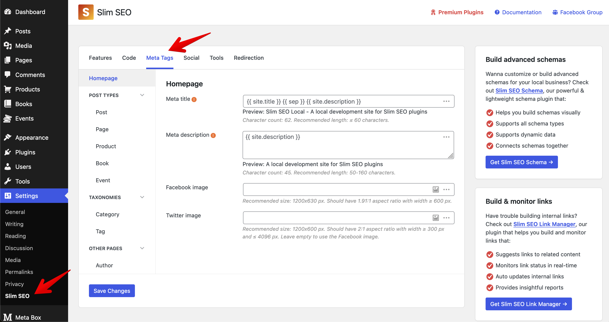
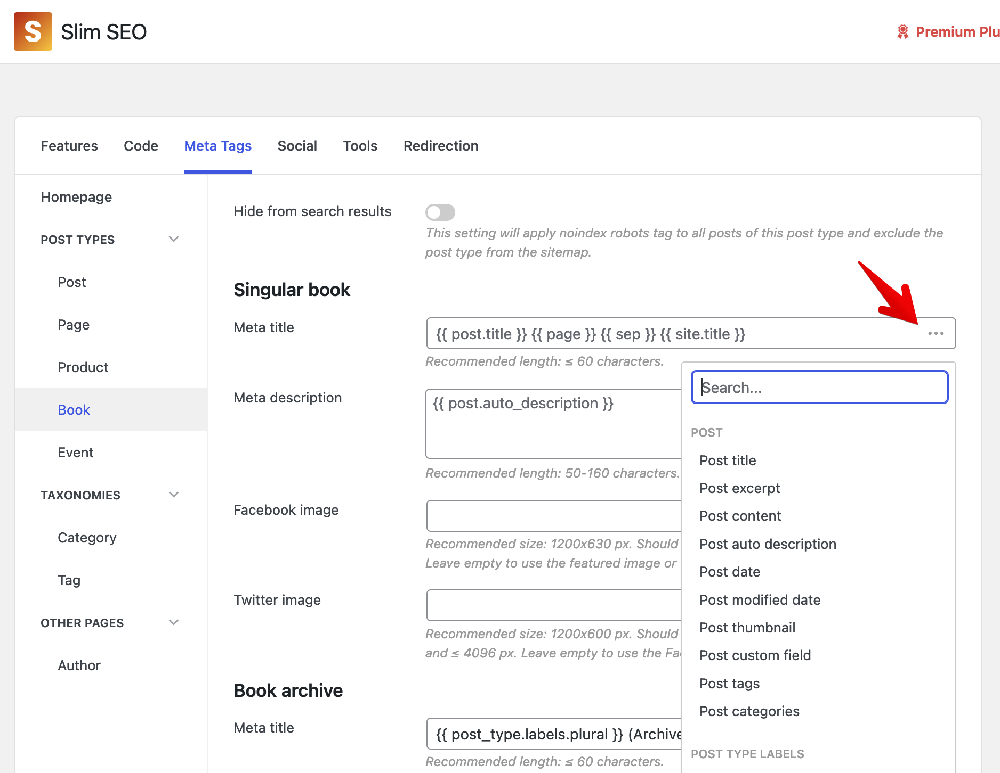
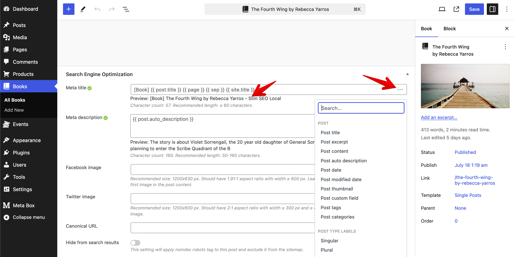

By default, WordPress sets the [meta title](/slim-seo/meta-title-tag/) to "Post title - Site title". But if you have an "event" post type and want to set the meta title to show the address and the date for all events. So when people search for events, they'll immediately see the details. Or you have a "book" post type and you want to show the author name of the book in the meta title.

It's not that it can't be done before, but it won't be able to do for a whole series of events because you have to write by hand for each event or book. It will be very time-consuming!

There's another popular example is review articles. When you write a review, let's say, [Slim SEO vs. SEOPress](https://wpslimseo.com/slim-seo-vs-seopress/), it needs to be updated every year. So every time you update it, you should change the year on the title to something like "2024 review". You'll need a way to update the year in the title automatically.

All the above can be done through a new feature of Slim SEO - dynamic variables.

## What are dynamic variables?

Essentially, a dynamic variable is a tag whose value can be changed according to the content or data of the article, website, or in real time. For example:

- the `{{ post.title }}` variable will be automatically replaced by the title of the current article
- `{{ post.custom_field.date }}` will be automatically replaced by the value of the custom field date,
- `{{ current.year }}` will be automatically replaced by the current year

In other words, dynamic variables will allow you to use dynamic data in meta tags like [title](/slim-seo/meta-title-tag/), [meta description](/slim-seo/meta-description-tag/), [Open Graph image](/slim-seo/facebook-open-graph-tags/), canonical URL, etc. Their value will be updated based on the data of the current post, the website, the author, and so it will help you eliminate the effort to enter by hand the custom values for the title or meta description.

## Setting up meta tags with dynamic variables

Go to **Settings > Slim SEO**, you'll see a new tab **Meta Tags**, replacing the two old tabs in previous versions, **Homepage** and **Post Types**. This tab allows you to configure meta tags for all types of content, including homepage, post types, taxonomies, and other pages, such as author archives.

For each type of content, you can configure meta title, meta description, Facebook and Twitter images. To load the dynamic variables, you just need to click the "3 dots" icon and select a dynamic variable:

When you select it, it will be inserted into the input box. You can select/insert multiple variables as you want. You can also type the variable into the input box, or type text between them.

## Using dynamic variables for single posts and terms

When you edit a single post, or single term (category, tag, or any taxonomy), the plugin also provides you with the same dynamic variables. But there is a big difference: **you can preview the value of the meta tags** as soon as you write it. This is a very important point for you to see how they are rendered as well as their length (and you'll see an indicator for whether they're too long or too short).

There is a small note about the preview. For post types or taxonomies in the settings page, the indicator for the number of characters and also the preview may not work. The reason is that the plugin won't be able to know which specific post or term you're configuring for. So, generating a preview won't be possible.

## List of available dynamic variables

Slim SEO supports some of the dynamic variables that have been carefully selected. These are variables for:

- Post
- Post type which is used for the post type archive page
- Taxonomy
- Author/User
- Site
- Some miscellaneous variables for the current year, page number, and separator character

Among these variables, there are some special variables like `{{ post.auto_description }}`, which is generated automatically from the post's excerpt. And if there is no excerpt, it will be generated automatically from the post's content. And for the term, the variable `{{ term.auto_description }}` will be generated automatically from the term description.

And there is a very important variable: the `{{ post.custom_field.xxx }}`, which allows you to choose a custom field for a meta tag. If you're using Meta Box or ACF, Slim SEO has built-in integrations with them, so you can select custom fields from [Meta Box](/slim-seo/integrations/meta-box/) and [ACF](/slim-seo/integrations/acf/) easily.
