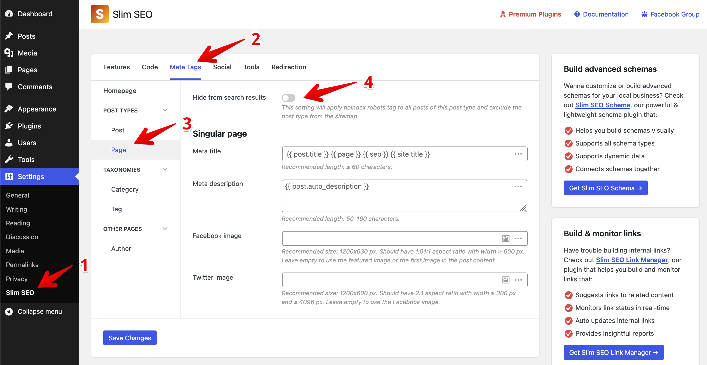

Sitemap is a **collection of URLs** of your sites that you provide to search engines to crawl. With it, search engines know which URLs to crawl, so your website is indexed faster and no URLs are missed.

When using Slim SEO, the sitemap is automatically created at `domain.com/sitemap.xml`, and you need to **submit this WordPress sitemap URL to search engines** (in Google Search Console and Bing Webmaster Tools).

:::caution No sitemap?

If you don't see the sitemap when visiting the URL, please go to **Settings > Permalinks** and re-save the settings. Then check the sitemap URL again.

:::

Although the sitemap is mostly used by search engines and is a technical page, Slim SEO also styles it for human reading:


To optimize the performance when generating sitemaps, the plugin splits the main sitemap into a list of smaller sitemaps:

- Post types: each post type has a sitemap.
- Taxonomies: each taxonomy has a sitemap.

The maximum number of links in a sitemap is 1000. You can use filters to change this number (see below).

Posts and terms which are [manually set as "noindexed"](/slim-seo/meta-robots-tag/) are excluded in the sitemap.

## Image sitemap

Slim SEO also includes the image sitemap by default to make sure your images are discoverable by search engines.

All the images that you insert in the post content are added to the sitemap. So, when someone searches for your images, they'll go to your posts to see the images.

The sitemap includes both self-hosted images and external images. Images in galleries or shortcodes are also parsed and included, too. For that reason, Slim SEO works with the default WordPress gallery shortcode and other WordPress gallery plugins.

:::caution

Image URLs are not visible to humans when you view the sitemap link. But they're there if you view the sitemap source code as they're made for search engines only.

:::

If you want to disable the image sitemap, use the following snippet:

```php
add_filter( 'slim_seo_sitemap_image', '__return_false' );
```

## Google News sitemap

Slim SEO also includes the sitemap for Google News by default to make sure your posts can be submitted to Google News.

The news sitemap is enabled for the default post type `post` only. It's not available for other post types. Slim SEO automatically adds details for news in the `sitemap-post-type-post.xml` sitemap (the sitemap for `post`). So you can use this URL `https://domain.com/sitemap-post-type-post.xml` to submit news sitemap to Google (or you can simply submit `https://domain.com/sitemap.xml` as usual as Google will discover the news sitemap by going through each sub-sitemap).

Similarly to the image sitemap, the details for news sitemap are not visible to humans when you view the sitemap link. But they're there if you view the sitemap source code as they're made for search engines only.

If you want to disable the news sitemap, use the following snippet:

```php
add_filter( 'slim_seo_sitemap_news', '__return_false' );
```

## Sitemap and robots.txt

The sitemap URL is automatically included in the `robots.txt` on your website if your website doesn't have a physical `robots.txt` file. WordPress automatically creates a virtual `robots.txt` for your website at `domain.com/robots.txt`. If you have a physical `robots.txt`, you need to add the sitemap URL by yourself.

## Multilingual sitemap

Slim SEO integrates well with multilingual plugins like **WPML**, **Polylang**, and **TranslatePress**.

Slim SEO strictly follows [Google's guidelines](https://developers.google.com/search/docs/specialty/international/localized-versions#sitemap) on creating a multilingual sitemap. According to the guidelines, the plugin adds `rel="alternate"` for every alternate version of the post or term in the sitemap. When the search engines view the sitemap, they see multiple links for all languages for each post. These links are not visible to humans, but you can see them when viewing the sitemap source code.

:::info
By following this method from Google, you won't have separated sitemaps for different languages. Instead, you'll have a global sitemap at `example.com/sitemap.xml` for all languages.
:::

For more details about multilingual sitemap, please see this article: [How to create a multilingual sitemap in WordPress](https://wpslimseo.com/wordpress-multilingual-sitemap/).

## Excluding post types

To exclude a post type from the sitemap, please go to **Settings > Slim SEO** and select the **Meta Tags** tab. Then pick a post type and enable the option **Hide from search engines**:



You can also use the following snippet:

```php
add_filter( 'slim_seo_sitemap_post_types', function( $post_types ) {
    return array_diff( $post_types, ['post_type_1', 'post_type_2'] );
} );
```

:::info

Excluding post types does **not** tell search engines to **not index** them. It simply doesn't send the post types' URLs to search engines. If search engines can discover posts in another way (by crawling your site), then they still can index them.

To tell search engines to not index these posts, it’s better to use [the robots tag](/slim-seo/meta-robots-tag/).
:::


## Excluding taxonomies

Similar to the above, if you want to exclude a taxonomy from the sitemap, please go to **Settings > Slim SEO** and select the **Meta Tags** tab. Then pick a taxonomy and enable the option **Hide from search engines**.

You can also use the following snippet:

```php
add_filter( 'slim_seo_sitemap_taxonomies', function( $taxonomies ) {
    return array_diff( $taxonomies, ['tax_1', 'tax_2'] );
} );
```

If you want to remove all taxonomies from the sitemap, use the following code:

```php
add_filter( 'slim_seo_sitemap_taxonomies', '__return_empty_array' );
```

## Post query

To get posts for the sitemap, Slim SEO makes a [query](https://developer.wordpress.org/reference/classes/wp_query/) to the database. If you want to change the query (for example, changing the number of posts per page or excluding some posts), then use the following snippet:

```php
add_filter( 'slim_seo_sitemap_post_type_query_args', function( $query_args ) {
    // Change the number of URLs
    $query_args['posts_per_page'] = 5000;
    return $query_args;
} );
```

The parameters are the same as in the [WP_Query](https://developer.wordpress.org/reference/classes/wp_query/) class.

## Taxonomy query

Similar to the above, if you want to change the query to get taxonomy terms, please use this snippet:

```php
add_filter( 'slim_seo_taxonomy_query_args', function( $query_args ) {
    // Change the number of URLs
    $query_args['number'] = 5000;
    return $query_args;
} );
```

The query parameters are the same as in the [get_terms()](https://developer.wordpress.org/reference/functions/get_terms/) function.

## User sitemap

By default, Slim SEO doesn't include the user sitemap. If you want to enable user sitemap, please use the following snippet:

```php
add_filter( 'slim_seo_user_sitemap', '__return_true' );
```

If you want to include only some users in the sitemap, you can change the user query args like this:

```php
add_filter( 'slim_seo_user_query_args', function( $args ) {
    $args['role'] = 'administrator';
    return $args;
} );
```

The parameters are the same as in the [get_users()](https://developer.wordpress.org/reference/functions/get_users/) function.

## Adding more URLs to the post sitemap

Slim SEO has a hook `slim_seo_sitemap_post` that allows you to add more URLs to **each post entry** in the sitemap. It's good if you want to add more URLs like image URLs or language URLs to **each post** in the sitemap.

```php
add_action( 'slim_seo_sitemap_post', function( WP_Post $post ) {
    // Add image URL from a custom field.
    $custom_image_url = get_post_meta( $post->ID, 'custom_image_url', true );
    if ( ! $custom_image_url ) {
        return;
    }
    echo "\t\t<image:image>\n";
	echo "\t\t\t<image:loc>", esc_url( $custom_image_url ), "</image:loc>\n";
    echo "\t\t</image:image>\n";
} );
```

If you want to add URLs (like other posts) to the sitemap, you can use output them like this:

```php
add_action( 'slim_seo_sitemap_post', 'ss_add_custom_posts_to_sitemap' );
function ss_add_custom_posts_to_sitemap() {
    // Used to make sure we output only once.
    static $output = false;
    if ( $output ) {
        return;
    }

    // Close the current `<url>` entry.
    echo "\t</url>\n";

    // List of custom URLs you want to add to the sitemap.
    $urls = [
        'https://domain.com/page-1',
        'https://domain.com/page-2',
    ];
    foreach ( $urls as $url ) {
        echo "\t<url>\n";
        echo "\t\t<loc>", esc_url( $url ), "</loc>\n";
        echo "\t</url>\n";
    }

    // Don't output next time.
    $output = true;
}
```

## Core sitemaps

Since version 5.5, WordPress includes sitemap functionality in the core. However, the core sitemaps lack some features that Slim SEO provides:

- **Image sitemap**: Slim SEO's sitemap includes images, which makes your site appear when people search for images.
- **Google News sitemap**: Slim SEO supports Google News sitemap, which makes your articles appear on Google News.
- **Multilingual sitemap**: each entry in the sitemap has its versions in other languages, which lets search engines know to index multilingual URLs, and your site might appear when people search in another language.

Because of these reasons, we disable the core sitemaps to avoid any conflict.
