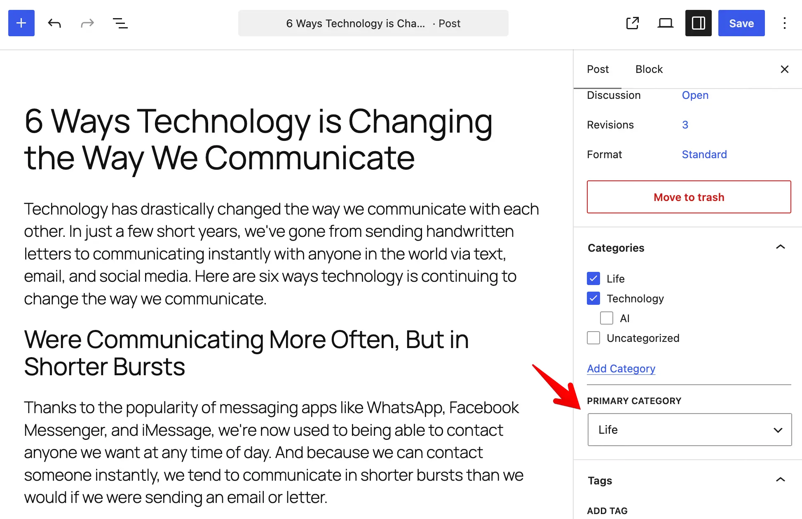
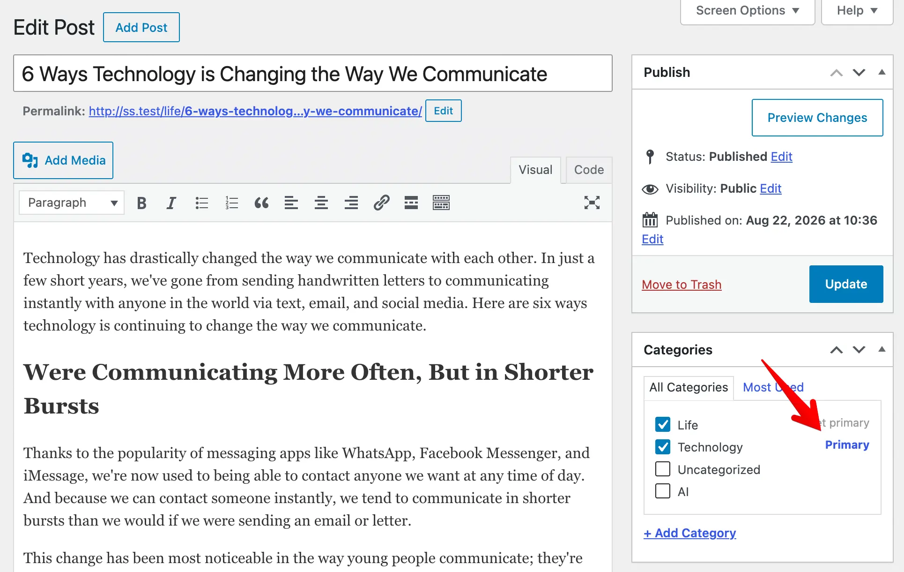

## What is a primary term?

A post can belong to many terms in a taxonomy. For example, a post can be in two categories, or a product can be in two product categories. When a post has no primary term, the plugin uses the first term for the breadcrumb and the permalink. That term is not always the most important one.

The primary term is the term that you mark as most important for the post.

## Why do you need a primary term?

When a post has many terms, search engines do not know which one is the main topic of the post. This gives weaker SEO results:

- The breadcrumb trail shows the wrong term.
- The permalink can change when you add or remove a term.
- The site hierarchy looks unclear.

A primary term fixes these problems. It makes the breadcrumb and the permalink stable for the post. The post keeps the same term even when its term set changes. This gives search engines a clear signal about the main topic of the post.

## Setting a primary term

You set the primary term in the post editor. The way you do it depends on the editor that you use.

### Block editor

In the block editor, select two or more terms in the taxonomy panel. The plugin then shows a "Primary" dropdown below the list of terms. Pick one term to set it as the primary term.



When you select only one term, the plugin uses it automatically. So the dropdown does not appear.

### Classic editor

In the classic editor, check the terms that you want for the post. When you select two or more terms, the plugin shows a link next to each checked one. Click the "Set primary" link to mark that term as the primary one. The active primary term shows the "Primary" label.



:::info Automation

When you do not set a primary term, the plugin keeps the default behavior. It uses the first term for the breadcrumb and the permalink. The primary term only changes the output when you choose it.

:::

## How the primary term affects permalinks

The primary term changes the post permalink **when the permalink structure contains a term placeholder**. A term placeholder has the form `%taxonomy_slug%`. It is the slug of the taxonomy wrapped in `%` characters.

For example, the placeholder for the `category` taxonomy is `%category%`. The placeholder for the `product_cat` taxonomy is `%product_cat%`.

By default, Slim SEO does the permalink rewrite for two post types:

- The `post` type, which uses the `category` taxonomy and the `%category%` placeholder.
- The WooCommerce `product` type, which uses the `product_cat` taxonomy and the `%product_cat%` placeholder.

For the `post` type, Slim SEO reads the structure from the global permalink structure. For the `product` type, it reads the structure from the WooCommerce product permalink settings.

When the post has a primary term, the plugin replaces the placeholder in the permalink with that term. For a hierarchical taxonomy, the permalink also includes the parent terms.

### Extending the permalink rewrite

The `slim_seo_primary_term_rewrite` filter lets you extend the permalink rewrite to other post types. The filter receives an array. Each post type in the array has two values:

- `taxonomy`: the taxonomy that provides the primary term.
- `structure`: the permalink structure of that post type. It is the structure that contains the term placeholder for that taxonomy.

For example, a custom post type named `book` uses a `genre` taxonomy. The permalink structure of the `book` post type contains the `%genre%` placeholder. The code below adds the permalink rewrite for the `book` post type:

```php
add_filter( 'slim_seo_primary_term_rewrite', function( $data ) {
	$data['book'] = [
		'taxonomy'  => 'genre',
		'structure' => '/books/%genre%/%postname%/',
	];
	return $data;
} );
```
