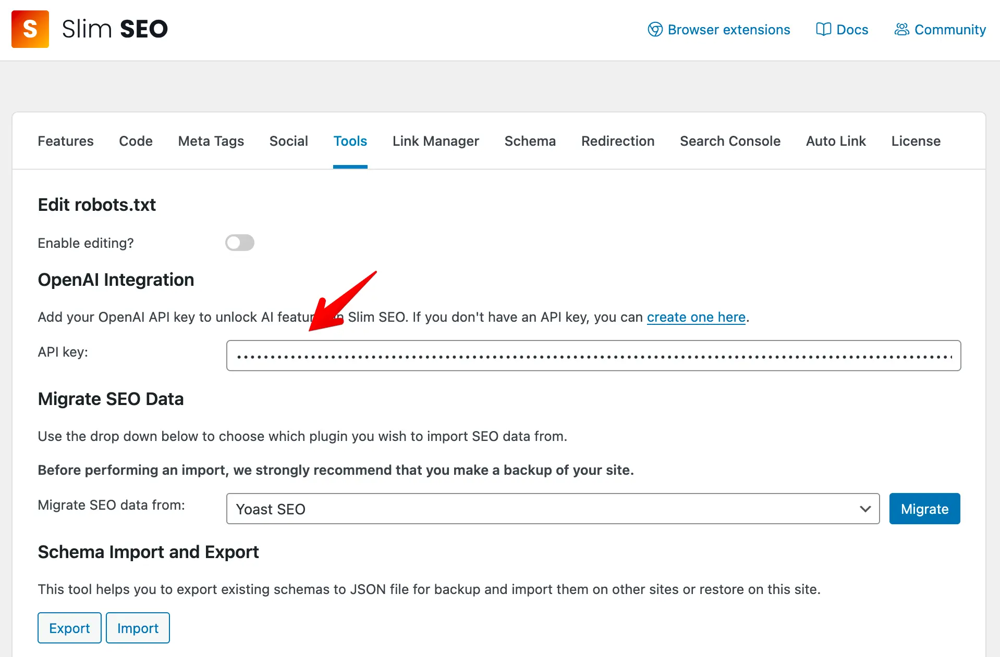
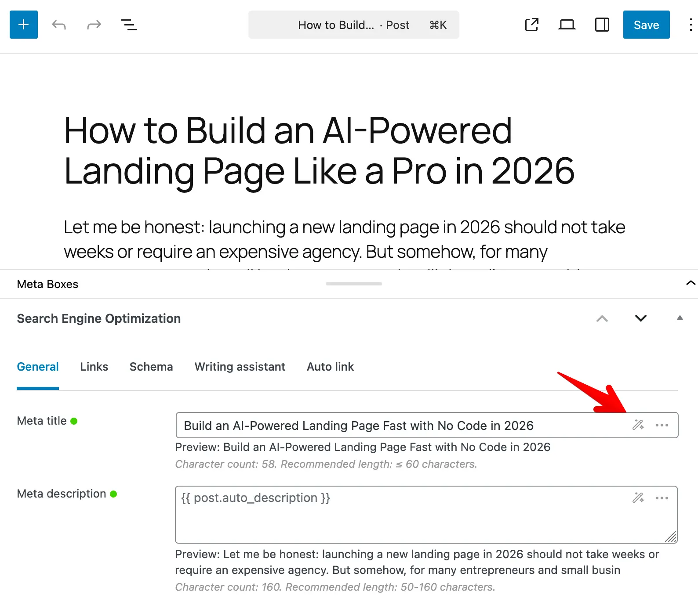
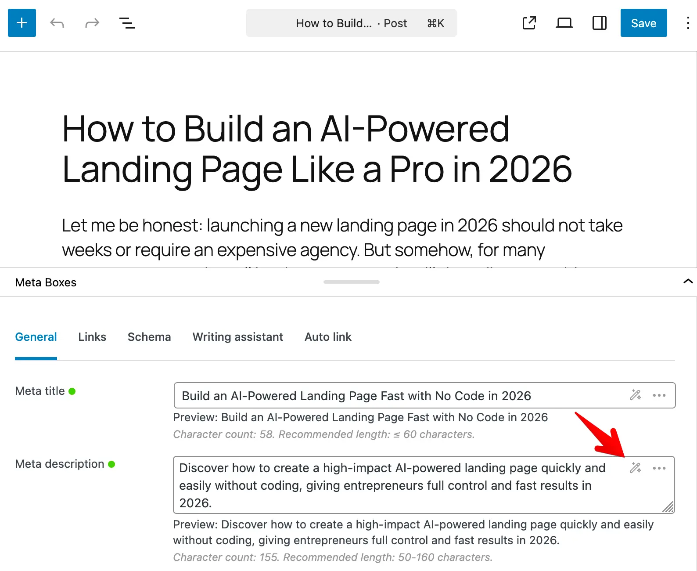

## Overview

Slim SEO includes an AI integration feature that automatically generates SEO-friendly [meta titles](/slim-seo/meta-title-tag/) and [meta descriptions](/slim-seo/meta-description-tag/) using OpenAI's artificial intelligence. This feature helps you create optimized meta tags without manual writing, saving time while improving your content's search engine visibility.

The AI integration uses OpenAI's GPT-4.1-mini model to analyze your content and generate meta tags that are:
- Optimized for search engines
- Written in the same language as your content
- Following SEO best practices
- Natural and engaging

## Requirements

To use the AI integration feature, you must have an OpenAI account with billing set up. Then you can create an API key at [OpenAI's API keys page](https://platform.openai.com/settings/organization/api-keys). This API key is used to authenticate your requests to OpenAI's API.

## Setting up OpenAI API key

1. Go to **Settings → Slim SEO → Tools** in your WordPress admin.
1. Enter your OpenAI API key in the **API key** field in the **OpenAI Integration** section.
1. Click **Save Changes**.

Once you enter an API key, the AI feature is automatically enabled. There is no separate "Enable AI" checkbox - the feature activates when an API key is present and deactivates when the key is removed.

## Generating meta titles

1. Edit a post or term.
2. Scroll to the **Meta title** field in the **Search Engine Optimization** meta box.
3. Click the **Generate with AI** button (magic wand icon).
4. The AI will analyze your post title and content (or term name and description) and generate an SEO-friendly meta title.
5. The generated title will appear in the field - you can edit it before saving if needed.

Please note that the post/term must have both a title and content/description. And the generated title will be:

- Between 50-60 characters (optimal for search engines)
- In the same language as your content
- Natural wording (not clickbait)
- No emojis, quotation marks, separators (|, -, :)
- No information not present in the title and content
- No keyword stuffing

## Generating meta descriptions

1. Edit a post or term.
2. Scroll to the **Meta description** field in the **Search Engine Optimization** meta box.
3. Click the **Generate with AI** button (magic wand icon).
4. The AI will analyze your post content (or term description) and generate an SEO-friendly meta description.
5. The generated description will appear in the field - you can edit it before saving if needed.

Please note that the post/term must have content/description. And the generated description will be:

- Between 140-160 characters (optimal for search engines)
- In the same language as your content
- Natural wording (not clickbait)
- No emojis & quotation marks
- No information not present in the content
- No keyword stuffing

## Regenerating meta tags

If you've already generated a meta tag using AI and want a different version:

1. Click the **Generate with AI** button again on the same field.
2. The AI will generate a new version with different wording while keeping the same meaning and SEO intent.
3. This is useful if you want to test different variations or need alternative phrasing.

## AI model

Currently, the plugin supports only OpenAI's GPT-4.1-mini model. This model may change in future plugin updates. The plugin will automatically handle any necessary API changes.

## Privacy and data

When you use the AI integration feature:

- Your post title and content are sent to OpenAI's servers
- OpenAI processes the data according to their privacy policy

For more information, please review [OpenAI's privacy policy](https://openai.com/policies/privacy-policy).
