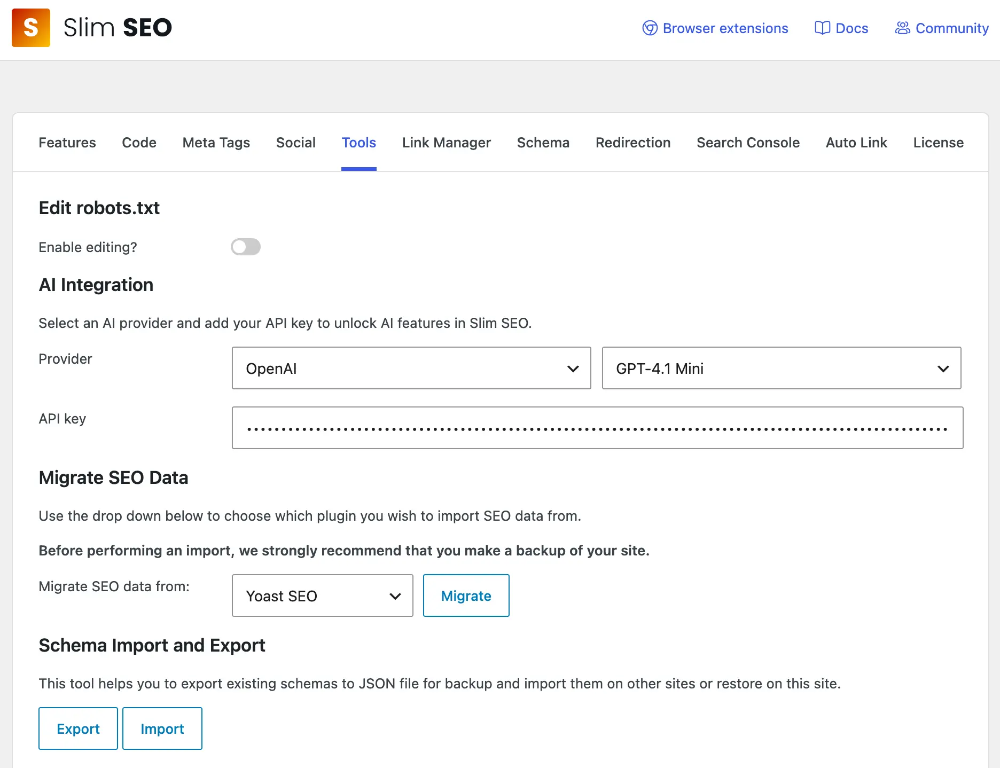
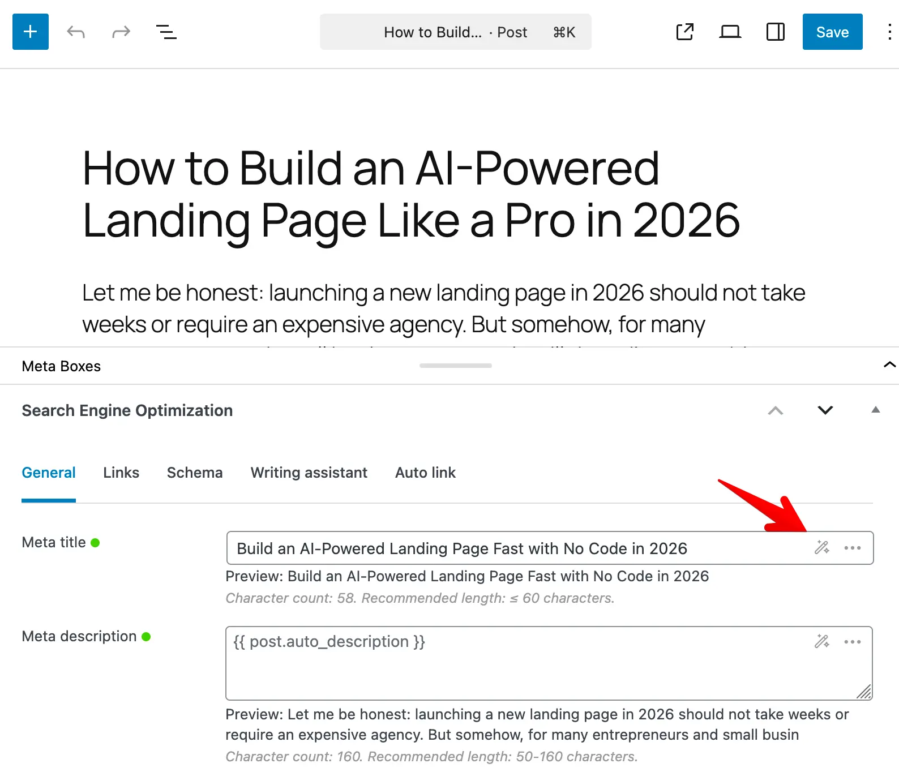
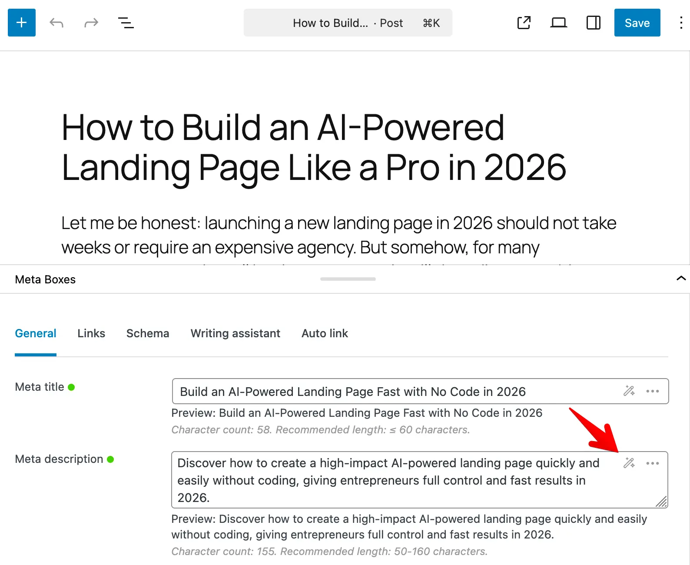

## Overview

Slim SEO includes an AI integration feature that automatically generates SEO-friendly [meta titles](/slim-seo/meta-title-tag/) and [meta descriptions](/slim-seo/meta-description-tag/). This feature helps you create optimized meta tags without manual writing, saving time while improving your content's search engine visibility.

The AI integration lets you select a popular AI provider - Anthropic (Claude), Google (Gemini), OpenAI (GPT), or OpenRouter - and a model to analyze your content and generate meta tags that are:
- Optimized for search engines
- Written in the same language as your content
- Following SEO best practices
- Natural and engaging

## Requirements

To use the AI integration feature, you must have an account with billing set up for one of the following providers:

- Anthropic (Claude)
- Google (Gemini)
- OpenAI (GPT)
- OpenRouter

Then, create an API key to use with Slim SEO.

## Setting up the API key

1. Go to **Settings → Slim SEO → Tools** in your WordPress admin.
1. Select an AI **provider**, then a **model**, and enter the **API key** for that provider.
1. Click **Save Changes**.



Once you enter an API key, the AI feature is automatically enabled. There is no separate "Enable AI" checkbox - the feature activates when an API key is present and deactivates when the key is removed.

## Generating meta tags

### Meta titles

1. Edit a post or term.
2. Scroll to the **Meta title** field in the **Search Engine Optimization** meta box.
3. Click the **Generate with AI** button (magic wand icon).
4. The AI analyzes your post title and content (or term name and description) and generates an SEO-friendly meta title.
5. The generated title appears in the field - you can edit it before saving if needed.



Please note that the post/term must have both a title and content/description. The generated title will be:

- Between 50-60 characters (optimal for search engines)
- In the same language as your content
- Written naturally (not clickbait)
- Free of emojis, quotation marks, and separators (|, -, :)
- Limited to information present in the title and content
- Free of keyword stuffing

### Meta descriptions

1. Edit a post or term.
2. Scroll to the **Meta description** field in the **Search Engine Optimization** meta box.
3. Click the **Generate with AI** button (magic wand icon).
4. The AI analyzes your post content (or term description) and generates an SEO-friendly meta description.
5. The generated description appears in the field - you can edit it before saving if needed.



Please note that the post/term must have content/description. The generated description will be:

- Between 140–160 characters (optimal for search engines)
- In the same language as your content
- Written naturally (not clickbait)
- Free of emojis and quotation marks
- Limited to information present in the content
- Free of keyword stuffing

### Regenerating meta tags

If you've already generated a meta tag using AI and want a different version:

1. Click the **Generate with AI** button again for the same field.
2. The AI generates a new version with different wording while keeping the same meaning and SEO intent.
3. This is useful if you want to test different variations or need alternative phrasing.

## Bulk generating meta tags

Slim SEO allows you to automatically create meta titles and descriptions for all your content at once using AI. To do that:

1. Go to **Slim SEO → Settings → Tools**
2. Find the **Bulk Generate with AI** section
3. **Select content types**: Check the post types (Posts, Pages, etc.) and taxonomies (Categories, Tags, etc.) you want to generate meta tags for
4. **Choose how to handle existing meta**:
   - Keep checked: Only generate for items without existing meta
   - Uncheck: Overwrite existing meta tags
5. Click **Generate**

The plugin will process in batches of 10 items. A "Show Logs" button lets you see details of each generated meta tag. If you want to change the number of processed items in a batch, use this snippet:

```php
add_filter( 'slim_seo_bulk_ai_batch_size', fn() => 20 );
```

The maximum value of processed items in a batch is `50`, to avoid heavy load on the server.

## Privacy and data

When you use the AI integration feature:

- Your post title and content are sent to the AI provider's servers
- The provider processes the data according to their privacy policy
- Slim SEO doesn't store or process your data, including the API key or the content sent between your website and the AI providers