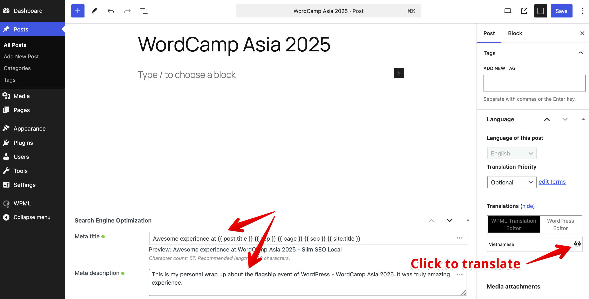
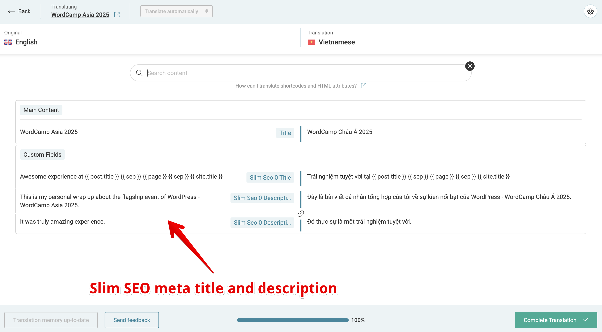
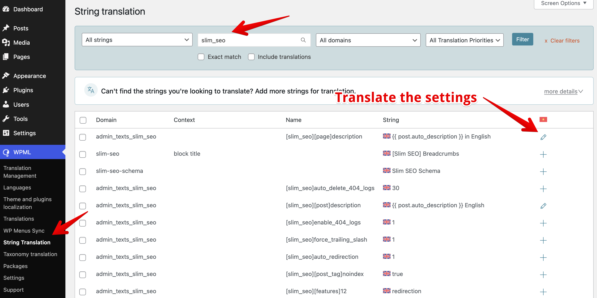

**WPML** is a powerful and trusted solution for managing multilingual content in WordPress. With over 1 million active users and more than 15 years of experience, WPML has become a market leader in WordPress translation management - helping you build professional, multilingual websites with ease.

If you're using **Slim SEO**, you'll benefit from a seamless integration with WPML that enhances your multilingual site's SEO performance.

## Translating meta title and description for posts

Slim SEO lets you set custom [meta titles](/slim-seo/meta-title-tag/) and [meta descriptions](/slim-seo/meta-description-tag/) for each post. With WPML, you can easily translate these meta tags by following these steps:

1. Open the post you want to translate.
   For example, you may have a post with manually set meta title and description like this:

   

2. On the right sidebar, in the **Translation** section, click the **plus icon** (or the **settings icon** if the translation already exists) next to the target language.

3. WPML will open the **Translation Editor** where you can translate your post content - including Slim SEO's meta tags:

   

You'll see Slim SEO's meta title and description fields in the translation editor. Simply translate them as you would with other fields.

## Translating meta tags settings

Slim SEO also includes a settings page where you can define default meta tags for post types and taxonomies using [dynamic variables](/slim-seo/dynamic-variables/):


You can translate these settings using WPML's [String Translation](https://wpml.org/documentation/getting-started-guide/string-translation/) module.

To do that:

1. Go to **WPML → String Translation**.
2. Enter **slim_seo** in the search box to find all Slim SEO strings.
3. In the results table, click the **plus icon** next to any setting you want to translate.



:::caution
If you don't see Slim SEO settings listed, it means those settings still use their default values. To make them appear, go to **Slim SEO → Meta Tags**, modify the default settings, and then return to the String Translation page - the settings should now be visible.
:::

:::info
You **cannot** switch languages from the admin bar and enter translations directly in the Slim SEO settings page.
All translations **must** be done in the WPML → String Translation screen.
:::

## Hreflang tags and multilingual sitemap

Another key part of multilingual SEO is the `hreflang` tag. This tag helps search engines understand which version of your content to display based on a visitor's language or region.

By default, WPML automatically outputs `hreflang` tags in the HTML of your posts on the front end. Slim SEO doesn't need to add anything manually. Here's what that looks like:

```html
<link rel="alternate" hreflang="en-US" href="http://ss.test/hello-world/"/>
<link rel="alternate" hreflang="vi" href="http://ss.test/vi/hello-world/"/>
<link rel="alternate" hreflang="x-default" href="http://ss.test/vi/hello-world/" />
```

Additionally, Slim SEO automatically adds `hreflang` tags to your [XML sitemap](/slim-seo/xml-sitemap/) for each post. This helps search engines better understand your site's language structure - even though it's not visible on the front end.

Here's how it appears in the sitemap source:

```xml
<?xml version="1.0" encoding="UTF-8"?>
<?xml-stylesheet type="text/xsl" href="http://ss.test/wp-content/plugins/slim-seo/src/Sitemaps/style.xsl"?>
<urlset xmlns="http://www.sitemaps.org/schemas/sitemap/0.9"
        xmlns:image="http://www.google.com/schemas/sitemap-image/1.1"
        xmlns:news="http://www.google.com/schemas/sitemap-news/0.9"
        xmlns:xhtml="http://www.w3.org/1999/xhtml">
	<url>
		<loc>http://ss.test/hello-world/</loc>
		<lastmod>2025-10-20T06:56:36+00:00</lastmod>
		<news:news>
			<news:publication>
				<news:name>My Site</news:name>
				<news:language>en</news:language>
			</news:publication>
			<news:publication_date>2025-10-20T06:56:36+00:00</news:publication_date>
			<news:title>Hello world!</news:title>
		</news:news>
		<xhtml:link rel="alternate" hreflang="en-US" href="http://ss.test/hello-world/"/>
		<xhtml:link rel="alternate" hreflang="vi" href="http://ss.test/vi/hello-world/"/>
		<xhtml:link rel="alternate" hreflang="x-default" href="http://ss.test/hello-world/"/>
	</url>
	<url>
		<loc>http://ss.test/vi/hello-world/</loc>
		<lastmod>2025-10-20T06:56:36+00:00</lastmod>
		<xhtml:link rel="alternate" hreflang="en-US" href="http://ss.test/hello-world/"/>
		<xhtml:link rel="alternate" hreflang="vi" href="http://ss.test/vi/hello-world/"/>
		<xhtml:link rel="alternate" hreflang="x-default" href="http://ss.test/hello-world/"/>
	</url>
</urlset>
```

Both approaches - using `hreflang` in HTML and including them in the XML sitemap - are [recommended by Google](https://developers.google.com/search/docs/specialty/international/localized-versions#sitemap) for properly handling multilingual websites.
