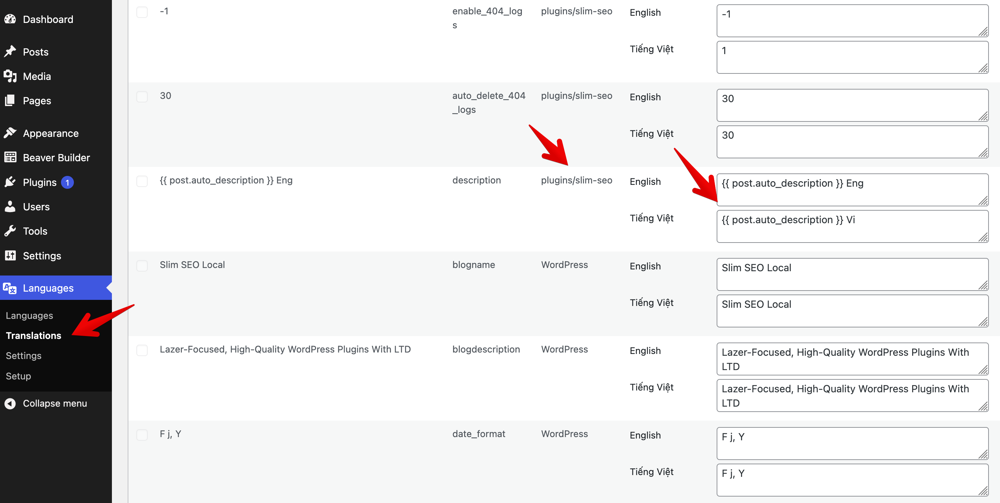

**Polylang** is a popular WordPress plugin that helps you easily create multilingual websites. It allows you to translate posts, pages, custom post types, widgets, menus, and more - all without needing a [separate WordPress installation](https://metabox.io/polylang-vs-wordpress-multisite/).

If you're using **Slim SEO**, you'll enjoy full integration with Polylang, helping you improve your multilingual site's SEO performance effortlessly.

## Translating meta titles and descriptions for posts

Slim SEO lets you set custom [meta titles](/slim-seo/meta-title-tag/) and [meta descriptions](/slim-seo/meta-description-tag/) for each post.
When you translate a post with Polylang, it automatically creates a new post for the translated version. So, to translate the meta title and description, simply open the translated post and enter the meta information as usual.

## Translating meta tags settings

Slim SEO includes a settings page where you can define meta tag templates for post types and taxonomies using [dynamic variables](/slim-seo/dynamic-variables/):


You can translate these settings directly in Polylang. Here's how:

1. Go to **Languages → Translations**.
2. Search for settings under the group `plugins/slim-seo`.
3. In the table below, translate the values for each language.



:::caution
If you don't see Slim SEO settings listed, it means they still use their default values. To make them appear, go to **Slim SEO → Meta Tags**, modify the default settings, and then return to the Polylang Translations page - the settings will now be visible.
:::

:::info
You **cannot** switch the language (from the admin bar language switcher) and enter translations directly on the Slim SEO settings page.
You **must** translate settings through Polylang's Translations page. Slim SEO always displays the settings for the default language.
:::

:::caution Known Issue
When you change meta settings for a post type, Slim SEO shows a preview of the meta title and description while editing posts. However, this preview always uses the **default language settings**.
On the front end, the correct settings are applied according to the current language.
:::

## Hreflang tags and multilingual Sitemap

Another key aspect of multilingual SEO is the `hreflang` tag. This tag helps search engines identify language and regional variations of your content.

By default, Polylang automatically adds `hreflang` tags to your pages' HTML on the front end - Slim SEO doesn't need to do anything extra. For example:

```html
<link rel="alternate" hreflang="en" href="http://ss.test/hello-world/"/>
<link rel="alternate" hreflang="vi" href="http://ss.test/vi/hello-world/"/>
<link rel="alternate" hreflang="x-default" href="http://ss.test/vi/hello-world/" />
```

In addition, Slim SEO automatically adds `hreflang` tags to your [XML sitemap](/slim-seo/xml-sitemap/) for each post.
These tags aren't visible on the front end but can be seen in the sitemap's source code:

```xml
<?xml version="1.0" encoding="UTF-8"?>
<?xml-stylesheet type="text/xsl" href="http://ss.test/wp-content/plugins/slim-seo/src/Sitemaps/style.xsl"?>
<urlset xmlns="http://www.sitemaps.org/schemas/sitemap/0.9"
        xmlns:image="http://www.google.com/schemas/sitemap-image/1.1"
        xmlns:news="http://www.google.com/schemas/sitemap-news/0.9"
        xmlns:xhtml="http://www.w3.org/1999/xhtml">
	<url>
		<loc>http://ss.test/hello-world/</loc>
		<lastmod>2025-10-20T06:56:36+00:00</lastmod>
		<news:news>
			<news:publication>
				<news:name>My Site</news:name>
				<news:language>en</news:language>
			</news:publication>
			<news:publication_date>2025-10-20T06:56:36+00:00</news:publication_date>
			<news:title>Hello world!</news:title>
		</news:news>
		<xhtml:link rel="alternate" hreflang="en" href="http://ss.test/hello-world/"/>
		<xhtml:link rel="alternate" hreflang="vi" href="http://ss.test/vi/hello-world/"/>
		<xhtml:link rel="alternate" hreflang="x-default" href="http://ss.test/hello-world/"/>
	</url>
	<url>
		<loc>http://ss.test/vi/hello-world/</loc>
		<lastmod>2025-10-20T06:56:36+00:00</lastmod>
		<xhtml:link rel="alternate" hreflang="en" href="http://ss.test/hello-world/"/>
		<xhtml:link rel="alternate" hreflang="vi" href="http://ss.test/vi/hello-world/"/>
		<xhtml:link rel="alternate" hreflang="x-default" href="http://ss.test/hello-world/"/>
	</url>
</urlset>
```

Both approaches - outputting `hreflang` in HTML and in the XML sitemap - are [recommended by Google](https://developers.google.com/search/docs/specialty/international/localized-versions#sitemap) for properly handling multilingual pages.
