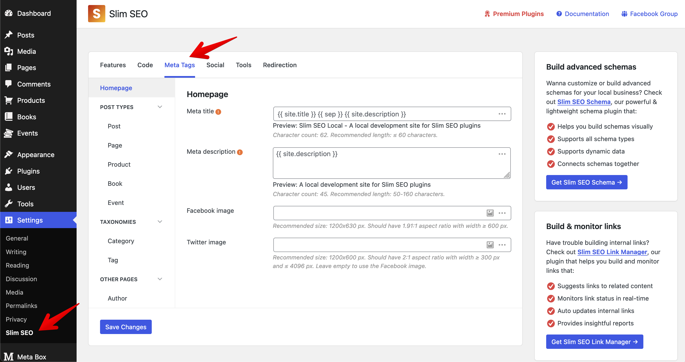

**Polylang** is a popular WordPress plugin that allows users to create multilingual websites easily. It enables you to translate posts, pages, custom post types, widgets, menus, and more into multiple languages without requiring a [separate WordPress installation](https://metabox.io/polylang-vs-wordpress-multisite/).

If you're a Slim SEO user, you'll have a full integration with Polylang, that helps you improve your multilingual site's SEO performance.

## Translating meta title and description for posts

Slim SEO allows you to set specific [meta title](/slim-seo/meta-title-tag/) and [meta description](/slim-seo/meta-description-tag/) for posts. When translating posts with Polylang, Polylang will automatically create another post for the translation. So, if you need to translate the meta title and description, simply enter them for that post as usual.

## Translating meta tags settings

Slim SEO has a settings page, where you can set up the meta tags for post types and taxonomies with [dynamic variables](/slim-seo/dynamic-variables/):



You can translate these settings with Polylang as well. Simply go to **Languages → Translation**, and find the settings you want to translate. Slim SEO's settings are listed under the group `plugins/slim-seo`.

Then in the table list below, you can translate the values for languages:


:::caution

If you don't see Slim SEO's settings here, that means that the settings is not modified and will use the default value. In this case, you need to modify the default settings value at **Slim SEO → Meta Tags**. Then go back to this screen and you'll see the settings.

:::

## Hreflang tag and multilingual sitemap

Another aspect of multilingual SEO is the `hreflang` tag. By default, Polylang automatically outputs the `hreflang` in the HTML of the posts on the front end, like this, so Slim SEO has to do nothing:

```html
<link rel="alternate" hreflang="en" href="https://example.com/wordcamp-asia-2025/" />
<link rel="alternate" hreflang="vi" href="https://example.com/vi/wordcamp-asia-2025/" />
```

However, in the [XML sitemap](/slim-seo/xml-sitemap/) for posts, Slim SEO will automatically adds `hreflang` tags to the sitemap **for each post**. This is not visible to human, but when you view the source code of the sitemap, you will see it like this:


Both methods (outputting in HTML and in XML sitemap) are the [recommended ways](https://developers.google.com/search/docs/specialty/international/localized-versions#sitemap) to tell Google about translations of your pages.
