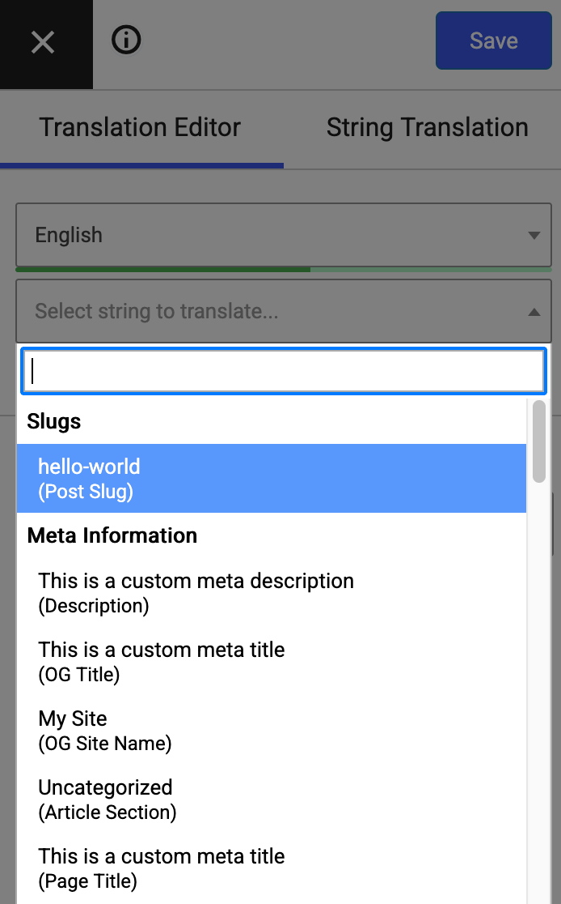

**TranslatePress** is a powerful and user-friendly WordPress translation plugin that lets you translate your entire website directly from the front end. It works seamlessly with any theme or plugin and supports both manual and automatic (AI-powered) translations. With its intuitive visual interface, you can easily build multilingual websites in just a few clicks.

If you're using **Slim SEO**, you'll enjoy a smooth integration with TranslatePress that helps enhance your multilingual site's SEO performance.

## Translating meta titles and descriptions

Slim SEO lets you set custom [meta titles](/slim-seo/meta-title-tag/) and [meta descriptions](/slim-seo/meta-description-tag/) for each post. You can translate these meta tags into different languages using the TranslatePress [SEO Pack add-on](https://translatepress.com/docs/addons/seo-pack/), which is included in all **premium versions**.

If you haven't activated the SEO Pack add-on, go to **Settings > TranslatePress > tab Addons** and activate the add-on:


To translate the meta title and description for a post, follow these steps:

1. Open the post you want to translate.
2. Click **Translate Page** from the WordPress admin bar.
3. In the translation interface, open the dropdown menu and find the **Meta Information** section.
   This section lists all Slim SEO meta tags that you can translate. Select one of them and start translating.



## Hreflang tags and multilingual sitemaps

A key part of multilingual SEO is the `hreflang` tag. This tag helps search engines understand which version of a page to show to users based on their language or region.

By default, TranslatePress automatically adds `hreflang` tags to your pages' HTML on the front end - Slim SEO doesn't need to do anything extra. For example, you'll see something like this in your page source:

```html
<link rel="alternate" hreflang="en-US" href="http://ss.test/hello-world/"/>
<link rel="alternate" hreflang="vi" href="http://ss.test/vi/hello-world/"/>
```

When it comes to sitemaps, Slim SEO automatically includes `hreflang` tags for each post in the [XML sitemap](/slim-seo/xml-sitemap/). These tags aren't visible on the front end but are available in the sitemap source code, which search engines use to understand your site structure better.

Here's what that looks like:

```xml
<?xml version="1.0" encoding="UTF-8"?>
<?xml-stylesheet type="text/xsl" href="http://ss.test/wp-content/plugins/slim-seo/src/Sitemaps/style.xsl"?>
<urlset xmlns="http://www.sitemaps.org/schemas/sitemap/0.9"
        xmlns:image="http://www.google.com/schemas/sitemap-image/1.1"
        xmlns:news="http://www.google.com/schemas/sitemap-news/0.9"
        xmlns:xhtml="http://www.w3.org/1999/xhtml">
	<url>
		<loc>http://ss.test/hello-world/</loc>
		<lastmod>2025-10-20T06:56:36+00:00</lastmod>
		<news:news>
			<news:publication>
				<news:name>My Site</news:name>
				<news:language>en</news:language>
			</news:publication>
			<news:publication_date>2025-10-20T06:56:36+00:00</news:publication_date>
			<news:title>Hello world!</news:title>
		</news:news>
		<xhtml:link rel="alternate" hreflang="en-US" href="http://ss.test/hello-world/"/>
		<xhtml:link rel="alternate" hreflang="vi" href="http://ss.test/vi/hello-world/"/>
		<xhtml:link rel="alternate" hreflang="x-default" href="http://ss.test/hello-world/"/>
	</url>
	<url>
		<loc>http://ss.test/vi/hello-world/</loc>
		<lastmod>2025-10-20T06:56:36+00:00</lastmod>
		<xhtml:link rel="alternate" hreflang="en-US" href="http://ss.test/hello-world/"/>
		<xhtml:link rel="alternate" hreflang="vi" href="http://ss.test/vi/hello-world/"/>
		<xhtml:link rel="alternate" hreflang="x-default" href="http://ss.test/hello-world/"/>
	</url>
</urlset>
```

Both approaches - adding `hreflang` tags in HTML and in the XML sitemap - are [recommended by Google](https://developers.google.com/search/docs/specialty/international/localized-versions#sitemap) for properly handling multilingual content.
