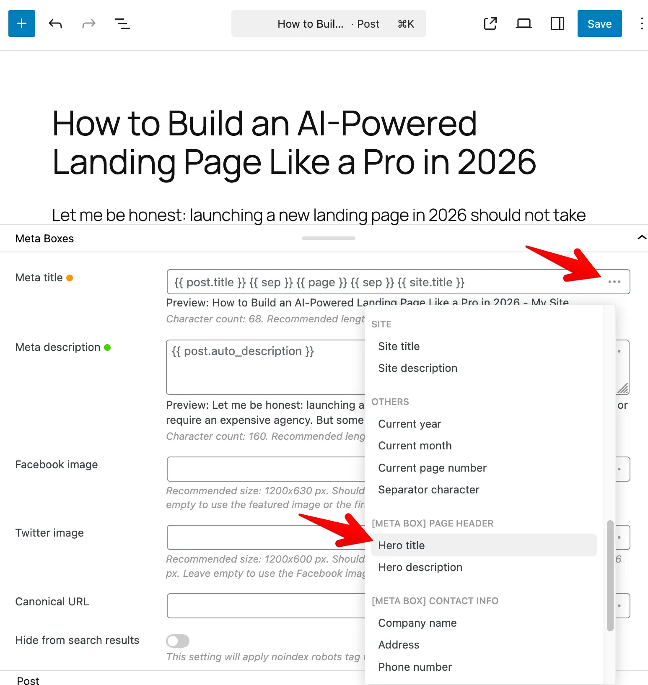

Slim SEO works with the [Meta Box](https://metabox.io) plugin so you can use your custom fields in meta titles and meta descriptions. When Meta Box is installed and active, is installed and active, the integration is automatically turned on.

## Adding Meta Box custom fields to meta tags

As you know, Slim SEO has a powerful meta tags configuration with [dynamic variables](/slim-seo/dynamic-variables/). This feature allows you to customize meta tags like title and description with variables that can change values depending on various contexts.

Now you can select custom fields from Meta Box for meta tags as shown below:

The variable is inserted in the form `{{ mb.meta_box_id.field_id }}`. For **groups**, the variable looks like: `{{ mb.my_box.my_group.subfield }}`. **Nested groups** are supported the same way: `{{ mb.my_box.parent_group.child_group.field }}`.

:::info

If your field or meta box ID uses hyphens, the variable will use underscores instead (e.g. `my-field` becomes `my_field` in `{{ mb.box.my_field }}`).

:::

**Examples:**

A meta box called "Product Info" with a field "Subtitle" might appear as **[Meta Box] Product Info** with an option like **Subtitle**. In the template you'll see something like `{{ mb.product_info.subtitle }}`.

## Supported field types

Most field types work. Slim SEO turns the stored value into something suitable for title or description text:

- **Text, number, date, etc.** - Value is used as-is (or formatted by Meta Box).
- **Choice fields** (dropdown, radio, checkbox list, etc.) - The selected option **label** is used.
- **File and image fields** - The file or image URL is used.
- **Post, taxonomy and user fields** - The linked post title, term name or user display name is used.
- **Cloneable and multiple-value fields:** only the **first** clone or first value is used. That is the intended behavior.

Fields that do not store a value (heading, divider, custom HTML, button) or don't have a suitable value (background, fieldset text, text list, sidebar) do not appear in the variable list.

## Supported object types

- **Post**: Value comes from the current post (the one whose title or description you are editing, or the post being viewed).
- **Term**: Value comes from the current term (the one whose title or description you are editing, or the term being viewed).
- **User**: Value comes from the relevant user (e.g. the post author or the author archive being viewed).
- **Setting pages**: Value comes from the Meta Box settings page(s) you registered.
