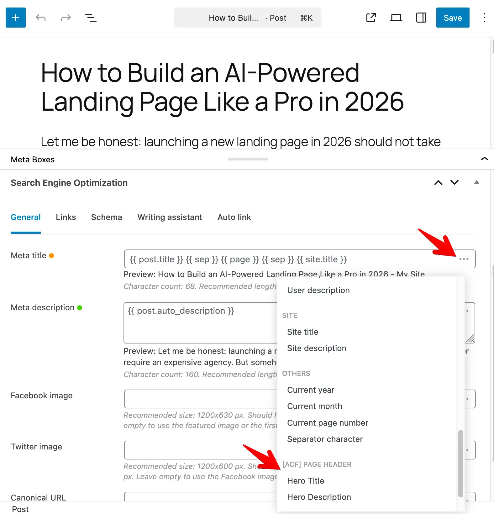

Slim SEO works with the [Advanced Custom Fields](https://www.advancedcustomfields.com/) (ACF) plugin so you can use your custom fields in meta titles and meta descriptions. When ACF is installed and active, the integration is automatically turned on.

## Adding ACF custom fields to meta tags

As you know, Slim SEO has a powerful meta tags configuration with [dynamic variables](/slim-seo/dynamic-variables/). This feature allows you to customize meta tags like title and description with variables that can change values depending on various contexts.

Now you can select custom fields from ACF for meta tags as shown below:

- For **groups**, the variable looks like: `{{ acf.my_group.subfield }}`. **Nested groups** are supported: `{{ acf.parent_group.child_group.field }}`.
- For **flexible content**, use the layout name as the key, then the sub-field: `{{ acf.flex_field.layout_name.subfield }}`. Only the first block of each layout type is used.

**Example:** A field group called "Product" with a field "Subtitle" might appear as **[ACF] Product** with an option like **Subtitle**. In the template you'll see `{{ acf.subtitle }}`.

## Supported field types

Slim SEO turns the stored value into text suitable for title or description:

- **Text, number, date, url, etc.** - Value is used as-is (or formatted by ACF).
- **Choice fields** (select, checkbox) - The selected option label is used.
- **File and image** - The file or image URL is used.
- **Link** - The link URL is used.
- **Post object and relationship** - The linked post title is used (first post only).
- **Taxonomy** - The term name is used.
- **User** - The user display name is used.
- **Repeater fields:** Only the **first** row is used. That is the intended behavior.
- **Flexible content:** Only the **first** block of each layout type is used. That is the intended behavior.
- **Multiple-value fields:** Only the **first** value is used.

Fields that do not store a value (message, accordion, tab) do not appear in the variable list.

## Supported object types

- **Post**: Value comes from the current post.
- **Term**: Value comes from the current term (when editing a term or on a term archive).
- **Post author**: Author fields are available when viewing or editing a post (from the post's author).
- **Options**: If you use an ACF options page, option fields are merged with post and term fields. If the same field name exists on both the current post (or term) and in options, the post or term value is used.
